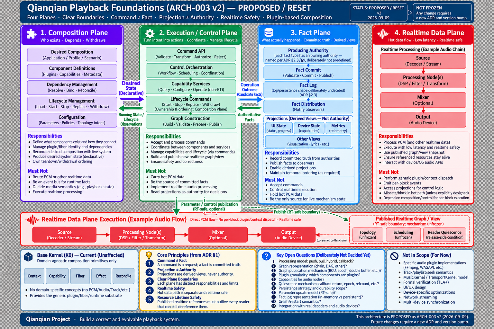

# Qianqian / 千千·现代

Qianqian is a local-first, lightweight, cross-platform music player and a testbed for Rust composability/runtime architecture.

At the top level, the repository contains two distinct product/component boundaries:

```text
SongCore  = independently versioned/released media-to-PCM component
Qianqian  = player product that consumes SongCore
```

SongCore owns media probing/metadata/artwork/stream selection/decode/seek and produces source-rate/source-layout Float32 PCM through its stable C ABI. Qianqian owns player behavior above that boundary: application/UI, playback/session policy, playlist/navigation, output backends/devices, and other product semantics. SongCore is therefore a reusable component, not merely an internal decoder implementation of Qianqian. See [`docs/architecture/overview.md`](docs/architecture/overview.md) for the system boundary and [`docs/architecture/songcore-binding-architecture.md`](docs/architecture/songcore-binding-architecture.md) for SongCore's cross-platform binding authority.

The repository is in **Architecture v2**. The first verified playback experiment was frozen, `main` was reset, and the implementation is being rebuilt boundary-first on a small generic Composition Kernel; the playback-specific foundation is **accepted** in `ADR-PBK-001` (plane-boundary constitution). Earned production playback minimums are owned by `ADR-PBK-002` D11/D14; broader semantics remain open.

## Architecture in 30 seconds

下图是 Architecture v2 reset 阶段留下的 Playback Foundations 历史 proposal 海报（图内自标 `PROPOSED / RESET`），仅为保留当时的视觉设计上下文；它不是当前架构的完整投影，也不是 normative authority。

[](docs/adr/ADR-PBK-001.md)

当前基础语义以 [`ADR-PBK-001`](docs/adr/ADR-PBK-001.md)（ACCEPTED）为准；当前 vocabulary、Plugin/Fiber taxonomy 与已挣得的静态 playback composition 以 [`ADR-PBK-002`](docs/adr/ADR-PBK-002.md) 为准；K0 语义以 [`composition-kernel-0-design.md`](docs/architecture/composition-kernel-0-design.md) 为准。当前架构图应从仓库内 Mermaid 源（`docs/architecture/diagrams/`）生成，而不是手绘海报。

The central rule is:

> **Kernel controls reachability, ownership and lifetime; it should not own application payloads.** (K0 design authority: `docs/architecture/composition-kernel-0-design.md`.)

But the project does **not** start by writing kernel APIs.

```text
Plugin granularity / ownership
        ↓
Capability / dependency boundary
        ↓
Interaction Algebra
        ↓
Effect / System Boundary
        ↓
Global lifecycle ordering
        ↓
Confluence oracle
        ↓
Composition Kernel implementation
```

Current architecture milestones:

```text
Component boundary audit          PASS / CLOSED              (PR #66)
Composition Kernel semantic design MERGED                   (PR #68)
Composition Kernel K0              IMPLEMENTED              (PR #71)
Playback Foundations reset         ACCEPTED                 (ADR-PBK-001, PR #87)
Publication/reclamation P1–P5      NORMATIVE (formal evidence, PR #91)
Minimal PCM contract evidence      DELIVERED (Phase B, PR #93)
Direct-flow graph evidence         DELIVERED (Phase C, PR #96)
Realtime-view publication/reclamation
mechanism evidence                 DELIVERED (PR #97; Issue #94 closed)
```

The previous playback architecture (the pre-reset ARCH-003 experiment, briefly accepted in former ADR revisions) was **deliberately reopened from first principles**; the reset foundation itself is accepted in `docs/adr/ADR-PBK-001.md` (**ACCEPTED**). Old playback implementation, specs and formal models remain in the repository as **experimental evidence only** — they preserve failure witnesses and test techniques, not current authority. PBK-002 D11/D14 now own the earned terminal/control/replacement/processing minimums; broader playback semantics remain OPEN beyond those amendments.

## Control plane and data plane

```text
                         CONTROL PLANE

                 desired composition
                          |
                          v
                 Composition Kernel
             Context / Capability / Fiber
                  Effect / Reconcile
                          |
                    resolve / bind
                          |
-------------------------------------------------------------
                          |
                         DATA PLANE
                          |
      Encoded Media -> Decoder -> Processing -> AudioOutput
```

> **Capability plane != Data plane.**

Context controls reachability/dependency truth. It does not carry PCM blocks or become a universal product message bus.

## Playback status: foundations accepted

The [playback execution model](docs/architecture/playback-execution-model.md) is the **FROZEN** cross-protocol entry (Stage 7 #210; subject `a225d524`): Stage 4 #207/#214 is merged, Stage 5 #208 made the wording explicit, #209 accepted D1–D6 (`PASS_ARCHITECTURE_ACCEPTED`), and #210 froze the architecture bound to validation contract #212 (PLAYBACK-EXECUTION-VALIDATION-v1; Stage-8 execution #211 not started). C1 establishment #205 and C2 machine-host settlement #213 are merged. Its §1 routes accepted authorities; §12 holds minimum-core 20/20 traceability.

There is still **no accepted playback state-machine vocabulary**. The accepted foundations (`docs/adr/ADR-PBK-001.md`) freeze foundational boundaries — composition vs execution/control vs facts vs realtime data — while current role names and the earned static playback composition are governed by `docs/adr/ADR-PBK-002.md`.

Names from the retired pre-reset experiments, such as:

```text
MusicKernel / TransportKernel
TrackSession / DecodeSession
Generation / Active-Prepared / Dual Window / Physical Fence
```

are **historical evidence only** (Git history and the PR records preserve the artifacts and their failure witnesses; the still-current races — terminal first-wins, stop × EOF × failure — are covered by today's tests and models): they are not current architecture and must not be re-imported unless a future accepted authority re-earns them.

See `docs/adr/ADR-PBK-001.md` for the accepted foundation, `docs/adr/ADR-PBK-002.md` for current vocabulary/static playback composition, and `specs/README.md` for what current verification exists today. The realtime publication/reclamation semantics (P1–P5) are normative in PBK-001 §6. Current Plugin/Fiber vocabulary is governed by PBK-002 D1/D4/D12, and Plugin admission by its D13 invariant; PBK-001 §16 retains older vocabulary as decision history where PBK-002 has superseded it.

## Everything is a Plugin

“Everything is a Plugin” means every **independently K0-composed lifecycle/behavior unit** has Plugin identity and is mounted as a Fiber. A Plugin may be episode-scoped or long-lived and need not provide a Capability. It does **not** mean one feature == one Plugin, one Plugin == one crate/DLL, every resource/payload == Plugin, or every DSP node is a Fiber. Independent composition is itself earned: if an existing Plugin can own the candidate without losing composition correctness or lifecycle ordering, it stays an owned resource/effect. Current taxonomy and the admission invariant: `docs/adr/ADR-PBK-002.md` D4/D12/D13 + `AGENTS.md` ("Everything is a Plugin / Fiber discipline").

## Interaction correctness

Commutative relations may compose as independent effects; non-commutative relations need explicit dependency/order/integration structure — registration order or container iteration is never semantic topology. Restoration is judged by **observational equivalence**, not bit identity, and already-rendered sound cannot be “unplayed” (physical emission lies outside the recoverable system boundary). Guardrails: `docs/architecture/composition-kernel.md`.

## Realtime boundary

Per audio callback/block there must be no Context lookup, capability resolution, Fiber reconciliation, generic event dispatch, filesystem/network I/O, UI round trips, or unbounded allocation/blocking. PCM flows through pre-bound direct data edges. Normative list: `docs/adr/ADR-PBK-001.md` §2.4.

## Formal verification policy

TLA+ is risk-driven evidence for concrete state/interleaving collisions, not a second architecture. The current earned formal target is realtime publication/lifetime: P1–P5 are normative in `ADR-PBK-001.md` §6, and mechanism validation evidence is in `docs/architecture/realtime-view-publication.md`. Old playback formal models are experimental evidence, not an acceptance gate. See `specs/README.md`.

## UI strategy

Current platform intent:

```text
Windows   -> PocketJS UiHost
Linux     -> PocketJS UiHost
Android   -> KuiklyUI UiHost
iOS       -> KuiklyUI UiHost
HarmonyOS -> KuiklyUI UiHost
macOS     -> KuiklyUI candidate / replaceable
```

UiHost owns rendering/input mechanism, not music semantics or realtime correctness.

## Current implementation status

Current Rust workspace:

```text
qianqian-composition
qianqian-audio-api
qianqian-app
qianqian-playback
qianqian-headless
```

The generic Composition Kernel (K0) is implemented. Current canonical vocabulary and production boundaries: ADR-PBK-002. The earlier experiment code (`MusicKernel` / `TransportKernel`) and its test-local traces harness were removed from main by the post-#139 spec reset (Git history archives them) — not current authority and not a compatibility contract.

Build/test authority:

```bash
cargo run -p qianqian-headless --bin qianqian-headless -- --help
cargo run -p qianqian-headless --bin qianqian-headless --features playback -- play <music-file-or-folder>
cargo test --workspace
```

The workspace builds two binaries from the same entry: `qianqian` — the
canonical product binary (a bare launch opens an interactive TUI with no
music loaded; `play` accepts files and/or folders and expands them into
a temporary track list) — and `qianqian-headless`, the historical
regression target. On Windows the product binary is `qianqian.exe`.

The temporary list carries the player's order and repeat preferences:
`Up`/`Down` browse it, `Enter` plays the selected row, `N`/`P` move
through it, `R` switches sequential/shuffle, and `L` cycles repeat
off/all/one — a track that finishes naturally advances according to
that policy (a `Stopped` or `Failed` track never does). `qianqian play
--shuffle <paths...>` starts in shuffle order. Seeking is `Left`/`Right`
(∓5 s), `Shift+Left`/`Shift+Right` (∓30 s) or `G` for a typed exact
time. `?` lists every key. The list lives in the process only: nothing
is written to disk, and there is no library, database or playlist file.

```bash
cargo run -p qianqian-headless --bin qianqian-headless --features playback -- play --shuffle "D:\Music"
```

## Historical preservation

Complete pre-Rust repository:

```text
branch: archive/pre-rust-v2
tag:    pre-rust-v2
```

Frozen playback reference:

```text
branch: research/playback-reference-v1
tag:    playback-reference-v1
```

The playback reference is a behavioral oracle, not a source-layout template.

## Repository entry points

- `QUICKSTART.md` — the end-user help shipped inside the Windows package (user documentation, not architecture).
- `AGENTS.md` — repository-wide agent governance and hard rules.
- `CONTEXT.md` — stable vocabulary and mental model.
- `docs/README.md` — task-oriented documentation router.
- `docs/architecture/overview.md` — current Architecture v2 overview, including the top-level SongCore/Qianqian system boundary.
- `docs/architecture/songcore-binding-architecture.md` — SongCore one-core/many-bindings authority and cross-platform binding rules.
- `docs/adr/ADR-PBK-001.md` — Playback Foundations constitution (ACCEPTED).
- `docs/adr/ADR-PBK-002.md` — current vocabulary, Plugin/Fiber taxonomy, static playback composition and D11 terminal-outcome authority.
- `docs/architecture/composition-kernel.md` — generic composition guardrails (derived summary; K0 authority: `composition-kernel-0-design.md`).
- `specs/README.md` — risk-driven formalization policy and model registry.
- `CONTRIBUTING.md` — contribution entry point.

## Scope

Qianqian is still a music player, not a generic framework product. The composability work exists to test whether strong component/lifecycle properties survive a real media runtime with explicit ordering, physical-system boundaries and realtime constraints.
