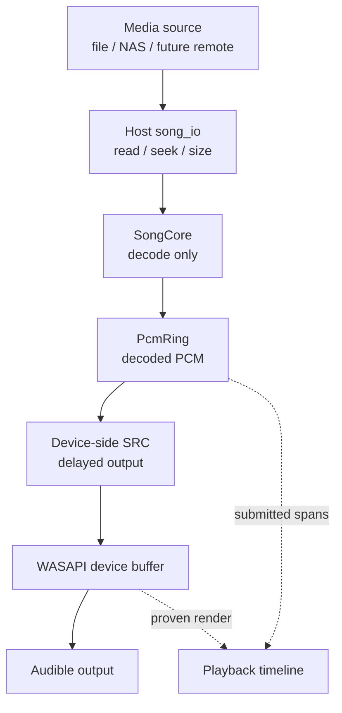
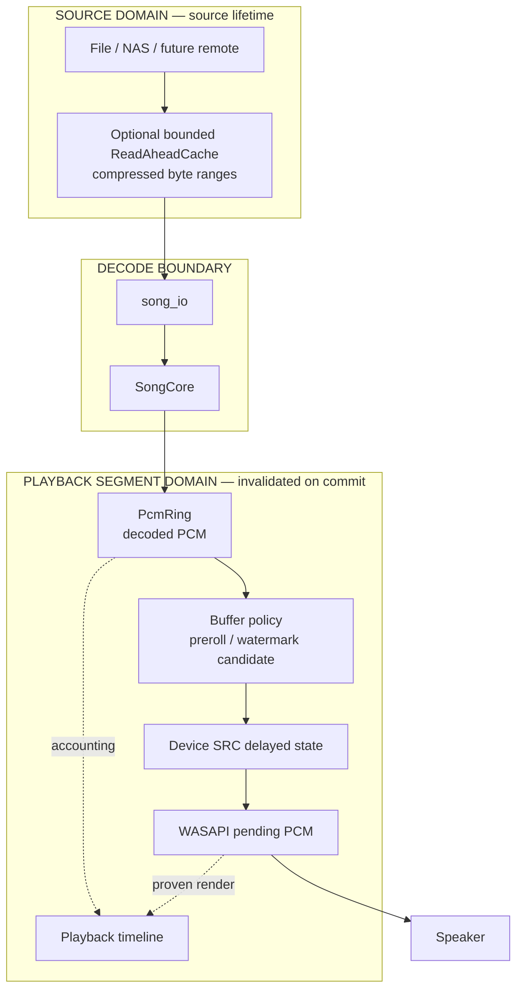
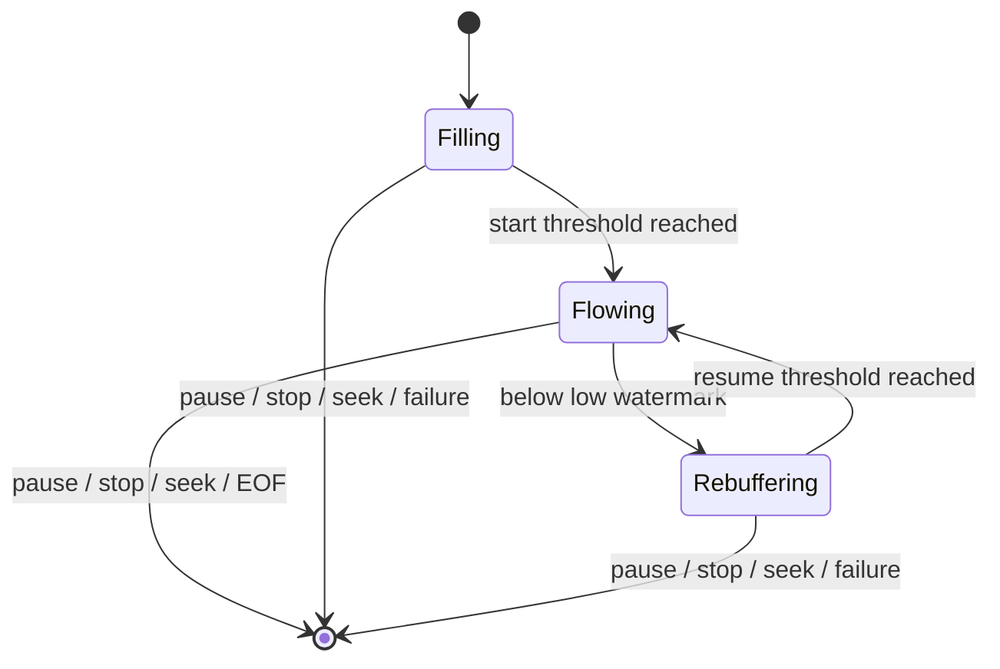
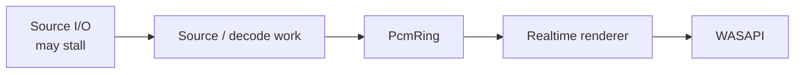

# ADR-0005: Playback buffering ownership and discontinuity boundaries

- Status: proposed
- Date: 2026-09-05

## Context

Qianqian already has multiple buffering points on the playback path, but they do not have the same purpose or lifetime:



The current `PcmRing` protects the realtime path from short producer jitter. When it cannot supply enough PCM, the frozen PlayerEngine contract emits GAP silence: device time continues while media time does not. This preserves timeline correctness, but a source or decode stall can still become an audible hole.

Issue #40 exposed a different class of problem. A seek could correctly invalidate the PlayerEngine queue and logical timeline while WASAPI still held submitted-but-unrendered PCM from the old segment. The machine position could therefore be correct while stale content remained audible. PR #42 propagates the PlayerEngine segment discontinuity to the physical renderer and drops superseded device PCM.

The follow-up resilience work in #43 must not solve source jitter by making the WASAPI buffer large, nor may it blur compressed-source caching, decoded-PCM buffering, timeline ownership, resampler delay, and device buffering into one generic cache.

## Decision

Qianqian uses distinct buffering ownership domains. Their units, invalidation rules, and purposes remain explicit.



The fundamental ownership rule is:

```text
Source bytes belong to the media source.
Decoded PCM, timeline spans, device-SRC delayed output, and device-pending PCM belong to the playback segment.
```

### Source-side buffering

A future `ReadAheadCache`, if #43 proves it worthwhile, lives behind the host I/O boundary and stores bounded compressed-source byte ranges. SongCore continues to see only `song_io`; it does not learn filesystem, NAS, HTTP, cache, or buffering policy.

Source caching is source-owned rather than segment-owned. A seek within the same media source may retain valid cached byte ranges and reposition the read cursor. This allows nearby or backward seeks to reuse already-fetched source data without permitting stale decoded PCM to cross the seek boundary.

The exact cache representation, forward/back split, range policy, memory bound, and whether local files need an application-level source cache at all are not decided by this ADR. They require #43 evidence.

### PCM buffering

`PcmRing` stores exact decoded media frames and is the isolation boundary between potentially blocking source/decode work and the realtime/device thread. It absorbs decode and scheduler jitter and can express an exact media-duration reserve.

PCM is segment-owned. Every playback commit that establishes a new segment invalidates PCM from the old segment.

### Timeline and device-SRC state

Playback timeline spans map submitted output to media time and therefore share the lifetime of their playback segment. They do not bridge a seek implicitly.

Any delayed output retained by device-side SRC is also segment-owned. It is pending audio, not a resilience cache, and must not leak into a later segment.

### WASAPI buffering

The WASAPI buffer exists for device scheduling and callback stability. It is intentionally latency-oriented and is not the disk, NAS, or network resilience buffer.

Increasing device-buffer depth to mask multi-second producer stalls is rejected as the architecture direction because it raises seek, pause, and interaction latency and enlarges the amount of stale physical output that must be invalidated on a discontinuity.

I/O resilience is therefore built upstream of the device buffer.

### Seek discontinuity

Seek is a cross-layer transaction that creates a new playback segment. Segment-owned state is invalidated; valid source-owned data may survive.

```mermaid
sequenceDiagram
    participant APP as Application
    participant PE as PlayerEngine
    participant PCM as PcmRing / Timeline
    participant SC as SongCore
    participant CACHE as Source cache
    participant WR as Renderer
    participant DEV as WASAPI

    APP->>PE: seek(T)
    PE->>PE: close admission; epoch N -> N+1
    PE->>PCM: drop old PCM and pending spans
    PE->>SC: song_seek(T)
    SC->>CACHE: seek/read source byte ranges
    Note over CACHE: valid source-owned ranges may survive
    SC-->>PE: actual landing
    PE->>PE: commit landing; segment N -> N+1
    PE->>PE: reopen admission
    WR->>PE: observe current segment
    PE-->>WR: segment N+1
    alt device still holds segment N
        WR->>DEV: Stop + Reset
        WR->>WR: rebase render accounting
        WR->>WR: discard device-SRC delayed state
    end
    SC->>PCM: decode segment N+1
    WR->>PE: fill output
    PE-->>WR: segment N+1 PCM
    WR->>DEV: submit clean new-segment output
```

The invariant is:

```text
Once segment N+1 has committed, no PCM belonging to segment N may become audible.
```

Pause/resume is not a discontinuity and does not create a new segment.

### Invalidation matrix

| Event | Source cache | Decoder state | PcmRing | Timeline pending | SRC delay | WASAPI pending |
|---|---|---|---|---|---|---|
| steady playback | keep | keep | keep | keep | keep | keep |
| pause / resume | keep | keep | keep | keep | keep | keep |
| seek same source | keep valid ranges / reposition | reset | drop | drop | drop | drop |
| stop to READY at 0 | may keep | reset | drop | drop | drop | drop |
| replay from ENDED | may keep | reset | drop | drop | drop | drop |
| open different source | replace source owner | replace | drop | drop | drop | drop |
| renderer teardown only | unaffected | engine-owned | engine-owned | engine-owned | drop | drop |

`May keep` means the architecture does not require invalidation; a bounded cache may still evict data according to its own policy.

### Buffer policy

A low/high-watermark or preroll controller is an internal policy candidate, not a new playback truth and not a new public state machine.



The exact thresholds, whether rebuffering is preferable to current GAP silence, local-versus-remote profiles, PCM capacity, and whether this controller should exist at all remain experimental questions owned by #43.

The existing public PlayerEngine states remain authoritative. This ADR does not authorize a public `BUFFERING` state or C ABI change.

### Realtime boundary

The device thread never performs filesystem, NAS, network, or other blocking source I/O.



The PCM reserve is the isolation boundary that keeps source latency away from the audio thread.

## Alternatives considered

- **Increase the WASAPI buffer** — rejected as the resilience architecture. It hides source stalls at the wrong layer while increasing interaction latency and stale-output exposure.
- **Only make `PcmRing` very large** — not selected as the general solution. It can absorb decode/scheduler jitter but requires already-decoded PCM and may impose unnecessary decoded-memory cost. PCM capacity remains an experimental knob.
- **Put read-ahead or network behavior inside SongCore** — rejected. SongCore remains a transport-agnostic decoder over `song_io`.
- **Flush every cache on seek** — rejected. Segment-owned data must be invalidated, but valid source-owned byte ranges may remain useful for the same media source.
- **One generic `PlaybackBuffer` abstraction** — rejected. Compressed bytes, decoded frames, timeline spans, SRC delay, and device PCM have different units, owners, lifetimes, and threading constraints.
- **Add a public `BUFFERING` state now** — rejected. #43 must first establish a product-visible semantic gap that cannot be represented honestly through the current contract and diagnostics.

## Consequences

- Seek correctness and playback resilience are separate concerns: a seek first establishes a clean physical discontinuity; buffering then minimizes the time until valid new-segment audio is available.
- Source caching can evolve independently above `song_io` without expanding SongCore or leaking transport details into the decoder.
- `PcmRing` remains the exact media-time reserve and realtime isolation boundary.
- WASAPI remains small and latency-oriented rather than becoming a general jitter reservoir.
- A playback commit invalidates segment-owned state without blindly discarding valid source-owned data.
- Any future cache is bounded; no resilience mechanism may introduce unbounded memory growth.
- Watermark values, source-cache admission, local/remote profiles, and rebuffer behavior remain evidence-driven decisions rather than architectural constants.

## Evidence

- `docs/contracts/player-api.md` — authoritative playback state, seek, timeline, underrun, and realtime semantics.
- `docs/architecture/platform-audio.md` — current device/render path and physical discontinuity behavior.
- `native/src/player/player_engine.cpp` / `.hpp` — epoch, segment, queue, and timeline ownership implementation.
- `native/src/player/wasapi_renderer.cpp` — device buffering, render accounting, and PR #42 discontinuity propagation.
- Issue #40 / PR #42 — real-Windows stale-audio defect and focused corrective.
- Issue #43 — evidence gate for jitter harness, watermark policy, and optional source read-ahead cache.
