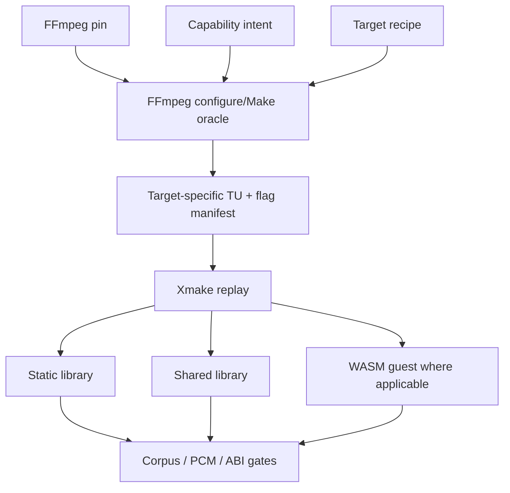

# FFmpeg minimization architecture

> Purpose: 当前生产使用的 FFmpeg 闭包方法——如何在不维护手改 fork 的前提下
> 交付一个小的 FFmpeg 解码核心。
> Scope: 方法、规则与机器输入契约。构建操作见
> [../development/build-native.md](../development/build-native.md)；实测
> 证据见 [../research/ffmpeg-minimization.md](../research/ffmpeg-minimization.md)；
> 决策理由见 [ADR-0004](../adr/0004-ffmpeg-machine-derived-closure.md)。

## Pipeline

```text
FFmpeg pin                    (ffmpeg/pin.json)
capability intent             (ffmpeg/capabilities/*.json, human-maintained)
target recipe                 (ffmpeg/targets/<id>.json, machine-readable)
        ↓  import/oracle only
target-specific FFmpeg configure/Make oracle
        ↓  machine compile manifest (build/manifests/<target>/<profile>/)
Xmake replay                  (xmake.lua replays the manifest)
        ↓
platform artifact             (libsongcore.a / .so / .dll / .dylib / .wasm)
```



The output is **reproducible from pin + capabilities + target recipe**.
That is the main durable result of the entire minimization work.

## Rules that make this safe

- **Upstream FFmpeg tree stays pristine.** Imported once into
  `build/ffmpeg-src/`; Qianqian never patches it.
- **`configure`/`Make` is an oracle, not the build.** It is invoked only at
  import/upgrade time to learn the real dependency graph and per-TU compile
  semantics for the pinned tag.
- **Normal builds are Xmake.** `xmake` never runs FFmpeg Makefiles; it
  replays the frozen compile manifest.
- **Capability intent is human-maintained; the source closure is
  machine-derived.** Nobody hand-maintains a "list of deleted FFmpeg
  files". The manifest records exactly what the pinned configure resolved
  for the declared intent.
- **Target manifests are target-specific.** The Linux closure is not reused
  blindly for Windows/macOS/Android/WASM; each target derives its own
  closure from the same intent + its own target recipe. Xmake enforces this
  fail-closed: a manifest derived for one target cannot satisfy a build
  session for another (negative-tested in
  `tests/songcore/target_gate_test.py`).
- **The shipping size authority is the final linked artifact**, never a
  source-count or directory-size proxy.

## Closure composition facts

- SongCore decode 基线：`libavformat` + `libavcodec` + `libavutil`。
- `libswresample` **不在** SongCore decode 基线内；它出现在闭包中的唯一
  原因是 FFmpeg n9.0.1 的 Opus decoder 在 upstream configure 图中的 build
  依赖——这是 decoder implementation dependency，不是 SongCore 能力
  （[ADR-0002](../adr/0002-songcore-src-boundary.md)）。
- SongCore decode 闭包明确排除：`libavfilter` / `libswscale` /
  `libavdevice` / ffmpeg / ffprobe / ffplay CLI。
- `libavfilter` 是 AudioEngine 的独立裁剪闭包，逐级成本证据见
  [../research/ffmpeg-minimization.md](../research/ffmpeg-minimization.md)
  与 [ADR-0003](../adr/0003-dsp-libavfilter-audioengine.md)。
- 构建从 `--disable-everything` 开始，只按真实 corpus 打开必要的
  demuxer / decoder / parser；`--disable-protocols` 原则生效，数据一律由
  host 经 `AVIOContext` 提供——Desktop 文件系统、Android URI/SAF、iOS
  security-scoped resource、WASM host IO 都由 host 管，FFmpeg 只看到字节，
  不获得网络或平台文件系统权限。

## Machine inputs (single source of truth)

| File | Meaning |
|---|---|
| `ffmpeg/pin.json` | pinned upstream tag + commit + source sha256 |
| `ffmpeg/capabilities/songcore.json` | codecs/containers SongCore must decode |
| `ffmpeg/capabilities/dsp.json` | libavfilter capabilities AudioEngine may use |
| `ffmpeg/targets/*.json` | machine-readable target recipes (platform/arch facts, artifact capability, honest proven status) |
| `ffmpeg/profiles/*.json` | capability profiles (codec base, test closure) |
| `build/.../manifest.json` | machine-derived closure for one (target, profile) pair (regenerable) |

## Upgrade flow

An FFmpeg upgrade re-runs import against the new pin, re-derives the
closure from the same capability intent, and the diff is review evidence
(source/flag/size/symbol/corpus/PCM drift). Never copy the old source list
forward.

## What the method produces

The reusable result is not "one Linux `libsongcore.a`" but the whole
pipeline: pin + capability intent + target recipe + oracle method +
manifest + Xmake replay. Which targets are proven vs planned is recorded
per-target in `ffmpeg/targets/*.json` (`status` fields); the API caller's
view of the artifacts is
[../contracts/songcore-api.md](../contracts/songcore-api.md). Measured
evidence: [../research/ffmpeg-minimization.md](../research/ffmpeg-minimization.md).
