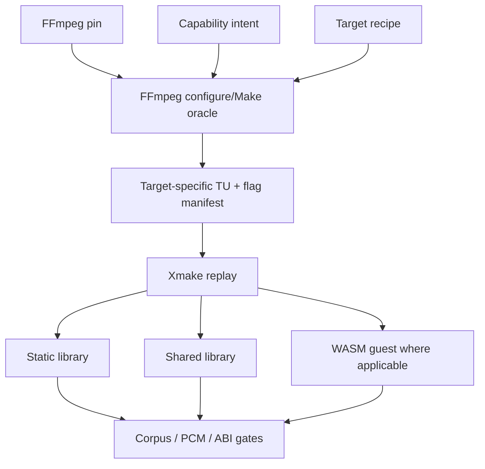

# FFmpeg Minimization

How Qianqian ships a small FFmpeg-based decoder without maintaining a
hand-edited FFmpeg fork. This is the reusable idea of the project.

## The pipeline

```text
FFmpeg pin                    (ffmpeg/pin.json)
capability intent             (ffmpeg/capabilities/*.json, human-maintained)
target recipe                 (ffmpeg/targets/<id>.json, machine-readable)
        ↓  import/oracle only
target-specific FFmpeg configure/Make oracle
        ↓  machine compile manifest (build/manifests/<target>/<profile>/)
Xmake replay                  (xmake.lua replays the manifest)
        ↓
platform artifact             (libsongcore.a / .so / .dll / .dylib / .wasm)
```



The output is **reproducible from pin + capabilities + target recipe**.
That is the main durable result of the entire minimization work.

### Rules that make this safe

- **Upstream FFmpeg tree stays pristine.** Imported once into
  `build/ffmpeg-src/`; Qianqian never patches it.
- **`configure`/`Make` is an oracle, not the build.** It is invoked only at
  import/upgrade time to learn the real dependency graph and per-TU compile
  semantics for the pinned tag.
- **Normal builds are Xmake.** `xmake` never runs FFmpeg Makefiles; it
  replays the frozen compile manifest.
- **Capability intent is human-maintained; the source closure is
  machine-derived.** Nobody hand-maintains a "list of deleted FFmpeg
  files". The manifest records exactly what the pinned configure resolved
  for the declared intent.
- **Target manifests are target-specific.** The Linux closure is not reused
  blindly for Windows/macOS/Android/WASM; each target derives its own
  closure from the same intent + its own target recipe. Xmake enforces this
  fail-closed: a manifest derived for one target cannot satisfy a build
  session for another (negative-tested in
  `tests/songcore/target_gate_test.py`).
- **The shipping size authority is the final linked artifact**, never a
  source-count or directory-size proxy.

### Upgrade flow

An FFmpeg upgrade re-runs import against the new pin, re-derives the
closure from the same capability intent, and the diff is review evidence
(source/flag/size/symbol/corpus/PCM drift). Never copy the old source list
forward.

## The build

```bash
xmake ffmpeg-import          # canonical native closure (host target recipe)
xmake f -m release           # native session
xmake build songcore         # both artifacts:
                             #   build/artifacts/libsongcore.a
                             #   build/artifacts/shared/libsongcore.so
```

Target-specific derivations name the target recipe instead of hand-typing
configure flags:

```bash
python3 tools/ffmpeg_profile_import.py \
    --target linux-x86_64 \
    --profile ffmpeg/profiles/codec-base.json
# → build/manifests/linux-x86_64/codec-base/manifest.json

xmake f -p mingw -m release \
    --av_manifest=build/manifests/windows-x86_64/codec-base/manifest.json
xmake build songcore_shared   # → songcore.dll
```

The manifest records its target identity; pointing a session at a manifest
derived for a different target fails the build with the re-derive
instruction. SDK roots / cross toolchains are selected through the
environment at derive time — machine-local absolute paths are rejected from
recipes and manifests.

Xmake owns: FFmpeg import/oracle replay, SongCore C/C++, libavfilter,
libswresample, native static/shared libraries, and cross-platform native
compilation. Xmake does **not** become the Kotlin/KMP build system; the
product side builds separately (Gradle / Kotlin Multiplatform) and links
the native artifact through FFI / JNI / cinterop.

## Machine inputs (single source of truth)

| File | Meaning |
|---|---|
| `ffmpeg/pin.json` | pinned upstream tag + commit + source sha256 |
| `ffmpeg/capabilities/songcore.json` | codecs/containers SongCore must decode |
| `ffmpeg/capabilities/dsp.json` | libavfilter capabilities AudioEngine may use |
| `ffmpeg/targets/*.json` | machine-readable target recipes (platform/arch facts, artifact capability, honest proven status) |
| `ffmpeg/profiles/*.json` | capability profiles (codec base, test closure) |
| `build/.../manifest.json` | machine-derived closure for one (target, profile) pair (regenerable) |

## What we obtained (measured, Linux)

### Current SongCore ABI v1 reference artifact

Machine-measured by `tools/measure_songcore_artifacts.py` into
`bench/results/songcore-v1/reference-artifacts.json` (codec-base closure,
205 TU):

```text
libsongcore.a          raw 30,216 B · stripped 18,118 B · xz -9e 8,444 B
libsongcore.so         raw 981,832 B · xz -9e 353,492 B
shared exports         exactly 15 song_* ABI symbols, zero av_*/ff_*/swr_*
dynamic dependencies   libm, libc
```

The static library is the decoder slice the application archives; the
shared library statically contains the whole FFmpeg closure with a
15-symbol export gate (`SONGCORE_API` + hidden default visibility +
`--exclude-libs`).

### Historical stages (superseded references, kept for continuity)

- **MP3 + FLAC source-minimization stage** (`bench/provenance/`): 205-TU
  oracle closure; shipping candidate (minimal closure, -Os -flto,
  `--gc-sections`) linked stripped 530,664 B / xz 180,408 B; decode
  ≥ 762× realtime. The ASM-disable variant was **rejected**: MP3 PCM
  diverged from the SIMD kernels.
- **Common Formats envelope** (final stage `c6-so-lto`,
  `bench/results/common-formats/summary.json`): 198 TU; historical
  5-symbol shared artifact raw 1,435,336 B / stripped 1,309,520 B / xz
  503,684 B; minimum decode throughput 392.83× realtime (ALAC). This was a
  shipping-shaped measurement, not the current 15-symbol product ABI — the
  current reference is the ABI v1 measurement above.
- **libavfilter DSP closure** (`bench/results/avfilter-minimize/shipping.json`):
  F1 core-gain-eq-tone 801,008 B stripped / 270,504 B xz; full F0–F7 DSP
  envelope 1,198,320 B stripped / 389,080 B xz. The permanent DSP/SRC smoke
  is `tests/songcore/dsp_src.py`.

## What the real output is

The result is **not** "one Linux `libsongcore.a`". The reusable result is
the whole pipeline: pin + capability intent + target recipe + oracle
method + manifest + Xmake replay. Do not reuse a Linux closure blindly for
other targets — derive each target's manifest from the same capability
intent with its own recipe (`tools/ffmpeg_profile_import.py --target ...`).
Which targets are proven vs planned is recorded per-target in
`ffmpeg/targets/*.json` (`status` fields); the API caller's view of the
artifacts is [songcore-api.md](songcore-api.md).

Historical narrative is archived in git history and
`docs/history.md`; the machine files above are the durable authority.
