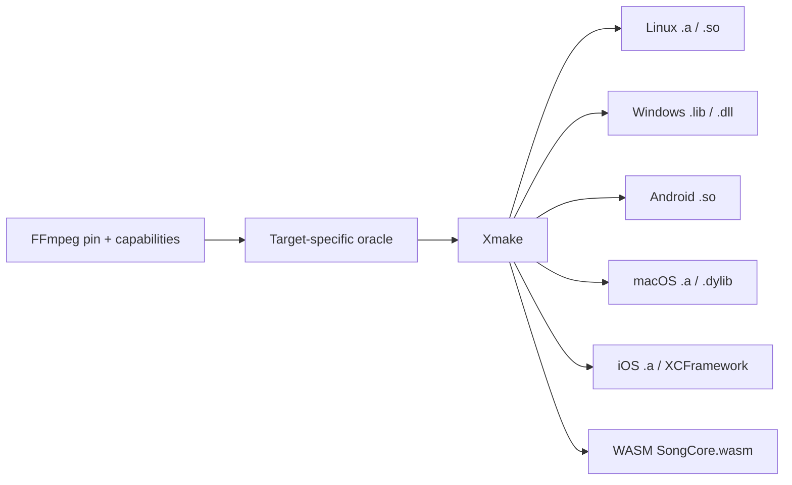

# FFmpeg Minimization

How Qianqian ships a small FFmpeg-based decoder without maintaining a
hand-edited FFmpeg fork. This is the reusable idea of the project.

## The pipeline

```text
product capability intent
        ↓  (human, machine-readable: ffmpeg/capabilities/*.json)
pinned upstream FFmpeg configure  (ffmpeg/pin.json → n9.0.1)
        ↓  (import/oracle only: tools/ffmpeg_import.py)
dependency / source closure       (which .c, with which flags)
        ↓  (machine-derived manifest, never hand-maintained)
Xmake replay                      (xmake.lua replays the manifest)
        ↓
target-specific native artifact   (libsongcore.a / .so / .dll / .a / .wasm)
```

### Rules that make this safe

- **Upstream FFmpeg tree stays pristine.** Imported once into
  `build/ffmpeg-src/`; Qianqian never patches it.
- **`configure`/`Make` is an oracle, not the build.** It is invoked only at
  import/upgrade time to learn the real dependency graph and per-TU compile
  semantics for the pinned tag.
- **Normal builds are Xmake.** `xmake` never runs FFmpeg Makefiles; it
  replays the frozen compile manifest.
- **Capability intent is human-maintained; the source closure is
  machine-derived.** Nobody hand-maintains a "list of deleted FFmpeg
  files". The manifest records exactly what the pinned configure resolved
  for the declared intent.
- **Target manifests are target-specific.** The Linux closure is not reused
  blindly for Windows/macOS/Android/WASM; each target derives its own
  closure from the same intent + its own toolchain.
- **The shipping size authority is the final linked artifact**, never a
  source-count or directory-size proxy.

### Upgrade flow

An FFmpeg upgrade re-runs import against the new pin, re-derives the
closure from the same capability intent, and the diff is review evidence
(source/flag/size/symbol/corpus/PCM drift). Never copy the old source list
forward.

## The build

```bash
xmake ffmpeg-import          # resolve closure once per fresh checkout
xmake f -o build/xmake       # normal native session
xmake build songcore         # → build/artifacts/libsongcore.a
```

Xmake owns: FFmpeg import/oracle replay, SongCore C/C++, libavfilter,
libswresample, native static/shared libraries, and cross-platform native
compilation. Xmake does **not** become the Kotlin/KMP build system; the
product side builds separately (Gradle / Kotlin Multiplatform) and links
the native artifact through FFI / JNI / cinterop.

## Machine inputs (single source of truth)

| File | Meaning |
|---|---|
| `ffmpeg/pin.json` | pinned upstream tag + commit + source sha256 |
| `ffmpeg/capabilities/songcore.json` | codecs/containers SongCore must decode |
| `ffmpeg/capabilities/dsp.json` | libavfilter capabilities AudioEngine may use |
| `ffmpeg/profiles/*.json` | capability profiles (codec base, test closure) |
| `build/.../manifest.json` | machine-derived closure for one target (regenerable) |

## What we obtained (measured, Linux)

### MP3 + FLAC stage

From `bench/provenance/source-minimization.json` (machine-derived, no
hand-entered numbers):

```text
oracle closure:           205 TU        (archive 2,658,174 B)
reachable closure:        110 → 106 TU
shipping candidate:       minimal closure, -Os -flto, --gc-sections
linked stripped binary:   530,664 B
xz:                       180,408 B
decode throughput:        ≥ 762× realtime (floor held)
```

The ASM-disable variant was **rejected**: MP3 PCM diverged from the SIMD
kernels on the corpus. That is the acceptance philosophy in action:
*aggressive trimming, conservative acceptance.*

### Common Formats envelope

From `bench/results/common-formats/summary.json` (final stage `c6-so-lto`):

```text
final closure:            198 TU
shared SongCore raw:      1,435,336 B
stripped:                 1,309,520 B
xz:                       503,684 B
minimum decode throughput: 392.83× realtime (ALAC, worst case)
dynamic dependencies:     libm, libc
exported API:             5 song_* symbols
```

About 1.3 MB stripped covers the mainstream local-music decode envelope
(MP3 / FLAC / AAC / M4A / ADTS AAC / ALAC / PCM WAV / Ogg Vorbis / Ogg Opus)
on the tested Linux build. The authority tree is read-only `--check`-gated.

### libavfilter DSP closure

From `bench/results/avfilter-minimize/shipping.json`. libavfilter is
treated as another capability repository: desired DSP filters → configure
oracle → source closure → Xmake replay → linked artifact.

```text
F1 core-gain-eq-tone (volume/equalizer/tone):   801,008 B stripped / 270,504 B xz
full F0–F7 DSP envelope:                       1,198,320 B stripped / 389,080 B xz
```

Core DSP capabilities have modest marginal cost; advanced
convolution/spatial/FFT features carry the larger shared live-code cost,
but the full envelope stays small enough to make trimmed libavfilter
viable. The permanent DSP/SRC smoke is `tests/songcore/dsp_src.py`.

## What the real output is

The result is **not** "one Linux `libsongcore.a`". The reusable result is
the whole pipeline:

```text
FFmpeg pin  +  capability intent  +  dependency-oracle method
    +  target-specific compile manifest  +  SongCore implementation  +  Xmake replay
```



Do not reuse a Linux closure blindly for other targets: derive each
target's manifest from the same capability intent with its own toolchain
(`tools/ffmpeg_profile_import.py --stage <target> --profile <profile>`).

Historical narrative is archived in git history and
`docs/history.md`; the machine files above are the durable authority.
