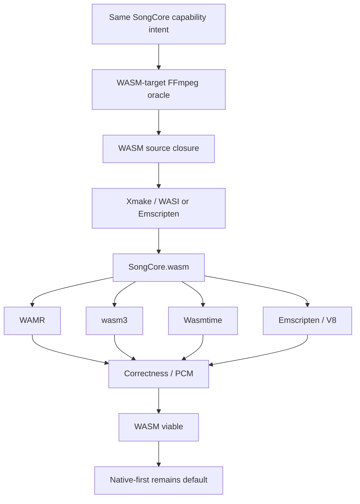

# WASM — can the same trimmed SongCore run as WASM?

> Status: concluded
> Decision authority: no
> Related decision: [ADR-0001](../adr/0001-native-first-wasm-viable.md)

Yes — and it was verified against machine evidence. WASM is a documented
future target, not the default path; native-first 是冻结决策
（[ADR-0001](../adr/0001-native-first-wasm-viable.md)），本文只保存证据与
推理。WASM 不是当前 shipping path 这一点的 current-truth 表述由
[architecture/](../architecture/) 与 ADR 拥有。

## Architecture result

```text
SongCore C ABI  (native/include/songcore.h, frozen v1)
        ↓
WASM bridge     (native/src/wasm/songcore_wasm_bridge.c — host I/O imports, PCM export)
        ↓
SongCore.wasm
```

The same capability intent (`native/ffmpeg/capabilities/*.json`) and the same
configure-oracle → manifest → Xmake replay method produce the WASM closure;
only the toolchain differs. Nothing about SongCore itself is WASM-specific.



## Proven conclusions

Measured over 44 fixtures with the same ABI exercised from a native twin and
from WAMR (interpreter + AOT), wasm3, Wasmtime, and Emscripten/V8:

- **Correctness**: every WASM runtime produced matching SongCore behavior —
  28 bit-exact + 16 within the declared float tolerance (max abs delta
  1e-6), 0 rejected. Inter-runtime gate: PASS, 0 mismatches over 44 cases.
  Re-proven per fixture against the Linux/Windows backends by
  `native/tests/songcore/ffi_consistency.py` (lossless PCM byte-exact).
- **Guest protocol**: the guest exports exactly the 15 contract mirrors plus
  three bridge-infrastructure exports — `song_wasm_alloc`/`song_wasm_free`
  (guest-heap buffers, so the host never guesses addresses; leak-checked by
  the smoke) and `song_wasm_layout` (machine-readable sizeof/offsetof table
  compiled from `songcore.h`, so no host hardcodes struct layout). See
  `tools/songcore_wasm_smoke.py` for the proven host side.
- **Interpreters carry a large runtime tax**: WAMR interpreter ≈ 41–76×
  slower than native; wasm3 ≈ 12–42×.
- **AOT/JIT approaches native-order performance**: WAMR AOT ≈ 0.72–1.27×,
  Wasmtime ≈ 1.01–1.85× (per-fixture execution tax vs the native twin).
- **Bridge (PCM transfer) tax**: WAMR AOT ≈ 17%, Wasmtime ≈ 4%,
  Emscripten/V8 ≈ 10% — the PCM copy across the boundary is small but not
  free; it shrinks relative to decode as decode cost grows.
- **Shipping size (xz -9e)**: native bundle ≈ 1.51 MB raw / 581 KB xz
  (single binary, no separate runtime); WASM guest module ≈ 1.29 MB raw /
  432 KB xz; WAMR AOT guest module ≈ 3.55 MB raw; the WAMR-AOT shipping
  bundle (runtime + AOT guest) ≈ 4.02 MB raw / 1.30 MB xz. Native is the
  smallest bundle with zero runtime tax.

### Artifact terminology (normative)

Size numbers in this document and in `bench/results/wasm-summary.json` are
different artifacts and must never be mixed:

| Term | Meaning | Reference values (raw / xz -9e) |
|---|---|---|
| guest module | `SongCore.wasm` alone, no runtime | 1.29 MB / 432 KB |
| AOT guest module | `SongCore.aot` alone (replaces the .wasm in AOT deployments) | 3.55 MB / 1.15 MB |
| runtime only | host runner / embedded runtime without a guest | 465 KB (WAMR runner) / 159 KB |
| runtime + guest bundle | the shipping package total | 1.50 MB native · 1.76 MB WAMR-interp · 1.50 MB wasm3 · 4.02 MB WAMR-AOT |

Durable machine summary: `bench/results/wasm-summary.json`. Full detail was
archived from the evaluation trees; git history preserves the raw runs.

## Why native-first remains the default

```text
same capability intent
  → native: smallest artifact, no runtime tax, direct C ABI
  → WASM:   viable, AOT/JIT close the gap, but a runtime and a bridge
            boundary are always present
```

WASM stays behind the same frozen ABI for a future embedder (web, plugin
sandbox, or portability experiment). The native build remains the shipping
default.
