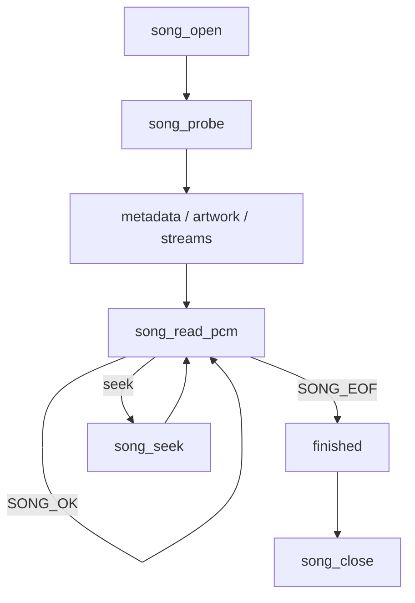

# SongCore API

How to call the SongCore native library. This is the permanent CALLER
document: it explains how to open a file, read PCM, seek, and close — for
C/C++ programs and for FFI wrapper authors (Kotlin/JVM, Kotlin/Native,
Swift/ObjC, Qt). It does not require FFmpeg knowledge and you do not need to
read any implementation file to use the library correctly.

For architecture (why SongCore exists, what AudioEngine does) read
[audio-core.md](audio-core.md). For the FFmpeg trimming method read
[ffmpeg-minimization.md](ffmpeg-minimization.md). The ABI authority is
[`include/songcore.h`](../include/songcore.h) — ABI v1, frozen.

- ABI version: `SONGCORE_ABI_VERSION` = 1. Layout is fixed; compatible
  additions use reserved fields or new functions, and any break is ABI v2.
- Public symbols: exactly **15**, listed in [§4](#4-api-reference). The
  shared library exports exactly these and nothing else (machine-audited).
- No FFmpeg type ever crosses this header.

## 1. Artifacts and linking

One conceptual library (`songcore`), two native artifact kinds plus a WASM
guest — all from the same ABI and capability model:

| Target | Static | Shared | Notes |
|---|---|---|---|
| Linux x86_64 | `libsongcore.a` | `libsongcore.so` | **Proven** — reference artifacts, measured + audited on this branch |
| Windows x86_64 | `songcore.lib` | `songcore.dll` | Planned (recipe: `ffmpeg/targets/windows-x86_64.json`) |
| Android arm64 | — | `libsongcore.so` | Planned |
| macOS arm64 | `libsongcore.a` | `libsongcore.dylib` | Planned |
| iOS arm64 | `libsongcore.a` | — | Planned (XCFramework packaging is a later product-side step) |
| WASM (wasi / emscripten) | — | — | Proven as guest module `SongCore.wasm` — uses the WASM bridge (`src/wasm/`), not native FFI; see [wasm.md](wasm.md) |

"Proven" means: oracle-derived manifest, Xmake replay, corpus/PCM/ABI gates
all green on this repository's evidence. "Planned" means the recipe exists,
nothing is claimed until a toolchain derives it (see
`ffmpeg/targets/*.json` `status` fields).

Xmake targets: `songcore_static`, `songcore_shared`, aggregate `songcore`.

```bash
xmake ffmpeg-import        # once per checkout: derive the FFmpeg closure
xmake build songcore       # → build/artifacts/libsongcore.a
                           #   build/artifacts/shared/libsongcore.so
```

Symbol visibility contract (`SONGCORE_API` in `songcore.h`):

- Link the static archive: nothing to define — plain declarations.
- Link `libsongcore.so` on ELF/macOS: nothing to define.
- Consume `songcore.dll` on Windows: define `SONGCORE_DLL` to get
  `dllimport`.

The shared library exports exactly the 15 ABI symbols. FFmpeg is statically
linked inside and never leaks a symbol (audited by
`tests/songcore/regression.py` and `tools/measure_songcore_artifacts.py`).
Shared dynamic dependencies on Linux: `libm`, `libc` only.

## 2. Lifecycle at a glance



One `song_handle` is one song file. `song_probe` selects the default
decodable audio stream and opens its decoder; every view afterwards
(`song_info`, metadata, artwork, PCM) refers to that selection.

### Minimal C example

```c
#include <songcore.h>
#include <stdio.h>
#include <stdlib.h>

static int64_t my_read(void *ud, uint8_t *dst, size_t size)  { /* host file read */ }
static int64_t my_seek(void *ud, int64_t off)                { /* host file seek */ }
static int64_t my_size(void *ud)                             { /* host file size */ }

void play_one_file(void) {
    song_io io = { .userdata = NULL, .read = my_read,
                   .seek = my_seek, .size = my_size };
    song_handle *song = NULL;

    if (song_open(&io, &song) != SONG_OK) return;

    song_info info;
    if (song_probe(song, &info) != SONG_OK) { song_close(song); return; }

    uint64_t cap = 4096; /* frames per pull */
    float *pcm = malloc(cap * info.channels * sizeof(float));
    for (;;) {
        uint64_t frames = 0;
        song_status st = song_read_pcm(song, pcm, cap, &frames);
        if (st == SONG_EOF) break;
        if (st != SONG_OK)  break; /* typed error; see song_last_error */
        /* pcm is Float32 interleaved, source rate/layout */
        send_downstream(pcm, frames, info.sample_rate, info.channels);
    }

    free(pcm);
    song_close(song);
}
```

## 3. The PCM contract (read this twice)

`song_read_pcm` output is **frozen**:

```text
sample format : Float32 (32-bit IEEE), native endianness
interleaving  : interleaved (not planar)
sample rate   : the SOURCE rate (SongCore never resamples)
channel layout: the SOURCE layout (mask from song_info.channel_mask)
```

Memory layout for stereo: `L0 R0 L1 R1 L2 R2 ...`. Buffer size in floats =
frames × channels. One "frame" = one sample per channel.

```text
SongCore performs NO sample-rate conversion.
SongCore performs NO DSP (gain/EQ/ReplayGain/crossfade/...).
```

Downstream (the future AudioEngine) decides: source matches output →
BYPASS; otherwise SRC = aresample/libswresample; DSP = capability-trimmed
libavfilter. SongCore ends at source PCM.

Partial success: if a decode error happens mid-call after some frames were
produced, the call returns `SONG_OK` with those frames, and the typed error
surfaces on the NEXT call (with zero frames). Format changes mid-stream
(rate/channel count/layout contradicting `song_info`) fail closed with
`SONG_ERR_STREAM_CHANGE` instead of emitting contradicting PCM.

## 4. API reference

Grouped by purpose; all 15 exported symbols. All functions take the handle
as first argument (except `song_open` / `songcore_abi_version`); all return
`song_status` (except `songcore_abi_version` / `song_close`); all write
results through out-parameters, which are untouched on failure unless stated.

### ABI

**`uint32_t songcore_abi_version(void)`** — returns `SONGCORE_ABI_VERSION`
(1). Callable at any time, including before any handle exists. FFI wrappers
should gate loading on it.

### Lifecycle

**`song_status song_open(const song_io *io, song_handle **out_handle)`** —
open a handle over caller-provided I/O. `io` holds three required callbacks
plus a `userdata` pointer passed back on every call:

- `read(dst, size)` → bytes read (>0), 0 at EOF, <0 on host error;
- `seek(absolute_offset)` → resulting absolute offset, <0 on host error;
- `size()` → total source size in bytes, <0 when unavailable.

SongCore has no filesystem, network, or URI semantics of its own — the
caller owns the bytes. On failure `*out_handle` is untouched and **no
diagnostic exists** (no handle to ask). Ownership: a successful
`song_open` transfers the handle to SongCore until `song_close`.

**`void song_close(song_handle *handle)`** — frees every SongCore-owned
resource and invalidates all borrowed views (metadata, artwork, error).
Safe in any state; `NULL` is a no-op. After `song_close` the handle must
not be used again.

**`song_status song_probe(song_handle *handle, song_info *out_info)`** —
parse the container, enumerate decodable audio streams, select the default
one (decodable audio only; prefer the container's default disposition,
else lowest index), open its decoder, build the song snapshot. Idempotent:
later calls return the cached snapshot. `song_info` carries source
`sample_rate`, `channels`, `channel_mask`, `duration_us` (−1 unknown),
`bits_per_sample` (0 when meaningless), stable ASCII `codec`/`container`
names, `selected_audio_index`, `audio_stream_count`.

### Stream selection

Decodable audio streams are enumerated 0..count−1 (`audio_index`).
`stream_index` is the absolute container stream index — identity
correlation only, never used in calls.

**`song_status song_audio_stream_count(song_handle *handle, uint32_t *out_count)`**
— number of decodable audio streams (excludes non-audio and
attached-picture streams). Requires a probed handle.

**`song_status song_audio_stream_info(song_handle *handle, uint32_t audio_index, song_stream_info *out_info)`**
— per-stream info: rates, layout mask, duration, codec, `is_default`.

**`song_status song_select_stream(song_handle *handle, uint32_t audio_index)`**
— explicit switch. Semantics (part of ABI v1): the old decoder is
destroyed and a new one opened; playback position resets to the start; the
metadata snapshot is REBUILT (all metadata views from before are
invalidated); container artwork is NOT affected and stays valid;
`song_info` fields (rate/layout/selected_audio_index) update; pending PCM
from the old stream is gone. Invalid `audio_index` →
`SONG_ERR_INVALID_ARGUMENT`.

### Metadata

After a successful probe/stream selection, SongCore holds an immutable
metadata snapshot. **Borrowed views**: returned pointers point into
SongCore-owned memory; the caller does NOT free them. Views stay valid
across `song_read_pcm`, `song_seek`, and EOF, and are invalidated by the
next `song_select_stream` or by `song_close`. Canonical precedence: the
selected stream's tags override container tags; absence is not an error —
presence is explicit via `has_*`.

**`song_status song_get_metadata(song_handle *handle, const song_metadata **out_meta)`**
— pointer to the immutable snapshot (title/artist/album/album_artist/
genre/composer/date/comment, track & disc numbers, ReplayGain in
microbels with peaks at 100000 = full scale). Copy it out if it must
outlive the borrowed-view lifetime.

**`song_status song_get_metadata_count(song_handle *handle, uint32_t *out_count)`**
— size of the raw metadata enumeration (container scope first, then the
selected stream scope; source parse order within a scope; duplicate keys
preserved). Unknown/future tags are readable here without any ABI change.

**`song_status song_get_metadata_entry(song_handle *handle, uint32_t index, song_metadata_entry *out_entry)`**
— one raw `(scope, key, value)` view; out-of-range index →
`SONG_ERR_INVALID_ARGUMENT`.

### Artwork

Compressed image bytes only (JPEG/PNG/...); SongCore never decodes images.
Deterministic container order. Views are SongCore-owned, valid until
`song_close`; stream selection does NOT invalidate them. Role is
best-effort: a single artwork is treated as front cover, otherwise mapped
from the source picture-type label when available. `width`/`height` are
−1 when unknown.

**`song_status song_get_artwork_count(song_handle *handle, uint32_t *out_count)`**
— 0..N artwork items.

**`song_status song_get_artwork_item(song_handle *handle, uint32_t index, song_artwork_item *out_item)`**
— one item: `role`, `mime` (+len), `data` (+data_len). The caller does not
free `data`.

### Decode

**`song_status song_read_pcm(song_handle *handle, float *dst, uint64_t frame_capacity, uint64_t *out_frames_produced)`**
— decode up to `frame_capacity` frames into caller-owned `dst` (see
[§3](#3-the-pcm-contract-read-this-twice)). `SONG_OK` → frames > 0;
`SONG_EOF` → frames == 0, normal end; anything else → typed error with
frames == 0. `frame_capacity == 0` → `SONG_ERR_INVALID_ARGUMENT`.

### Navigation

**`song_status song_seek(song_handle *handle, int64_t requested_position_us, int64_t *out_actual_position_us)`**
— playback-oriented seek (NOT sample-perfect unless the format proves
it). The target is clamped against the known duration, converted to a
container seek at/before the target; the decoder is flushed and all
pending PCM state is cleared; the next `song_read_pcm` belongs to the
landing point. `*out_actual_position_us` reports the landing measured
from the first decoded frame's timestamp; −1 means the position is
genuinely unknown (never manufactured); the out-pointer may be NULL.
Lossless formats land frame-accurate; lossy/lapped codecs may differ from
sequential decode within bounded codec-frame tolerance. After a
successful seek: metadata, artwork, stream selection, rate/layout/codec
are all unchanged. Errors: `SONG_ERR_SEEK_UNSUPPORTED` (container cannot
seek), `SONG_ERR_SEEK_ERROR`, `SONG_ERR_STREAM_CHANGE` /
`SONG_ERR_DECODE_ERROR` if the landing frame cannot be converted
(fail-closed).

### Diagnostics

**`song_status song_last_error(song_handle *handle, const song_error **out_error)`**
— diagnostic for the last failed operation on this handle: NUL-terminated
UTF-8 `message` (+`message_len`), backend `native_code`. For logs only —
callers branch on `song_status`, never on message text. Valid until the
next SongCore call on the same handle; after a successful call the
message is NULL. Not available for `song_open` failures (no handle).

## 5. Error model

`song_status` is typed; EOF is a normal terminal condition, not a failure.

| Status | Meaning |
|---|---|
| `SONG_OK` (0) | success |
| `SONG_EOF` (1) | end of decoded PCM |
| `SONG_ERR_INVALID_ARGUMENT` | null/illegal argument |
| `SONG_ERR_STATE` | call not allowed in current state |
| `SONG_ERR_NOT_OPEN` | operation needs a probed handle |
| `SONG_ERR_IO` | host I/O failure (your callbacks) |
| `SONG_ERR_UNSUPPORTED_CONTAINER` | container not decodable |
| `SONG_ERR_NO_AUDIO_STREAM` | no decodable audio stream |
| `SONG_ERR_UNSUPPORTED_CODEC` | stream codec not in the capability set |
| `SONG_ERR_CORRUPT_DATA` | malformed bitstream |
| `SONG_ERR_DECODE_ERROR` | decode failure mid-stream |
| `SONG_ERR_SEEK_UNSUPPORTED` | container has no seek |
| `SONG_ERR_SEEK_ERROR` | seek failed |
| `SONG_ERR_STREAM_CHANGE` | decoder changed rate/layout mid-stream (fail-closed) |
| `SONG_ERR_OUT_OF_MEMORY` | allocation failure |
| `SONG_ERR_INTERNAL_ERROR` | bug guard; please report |

## 6. Threading

A `song_handle` is NOT internally thread-safe: serialize all calls on one
handle externally. Different handles may be used concurrently from
different threads. SongCore adds no internal mutexes — an FFI wrapper that
exposes one song to multiple threads owns the lock. `songcore_abi_version`
is the only safely callable-anywhere function.

## 7. FFI guidance (Kotlin/KMP, Swift, Qt, ...)

```text
Kotlin / KMP  (or Swift / Qt / ...)
      ↓  JNI / JNA / Panama / cinterop /binding
songcore.h  (ABI v1)
      ↓
libsongcore.so · songcore.dll · libsongcore.a · static native integration
```

- The FFI wrapper owns the language-side object lifetime; the native
  `song_handle` stays opaque. Never mirror FFmpeg structures — there are
  none in the ABI.
- Gate library load on `songcore_abi_version()`.
- Copy metadata/artwork out into managed objects if they must outlive the
  native borrowed-view lifetime (§4); otherwise borrow within the stated
  lifetime.
- PCM buffers should avoid unnecessary copies where the platform FFI
  permits (e.g. direct Float32 buffers over JNI, `HEAPF32` over WASM).
- One wrapper object ⇔ one native handle; a `close()` in the wrapper must
  reach `song_close` exactly once.

No framework-specific bindings are part of this repository (Phase 0).
