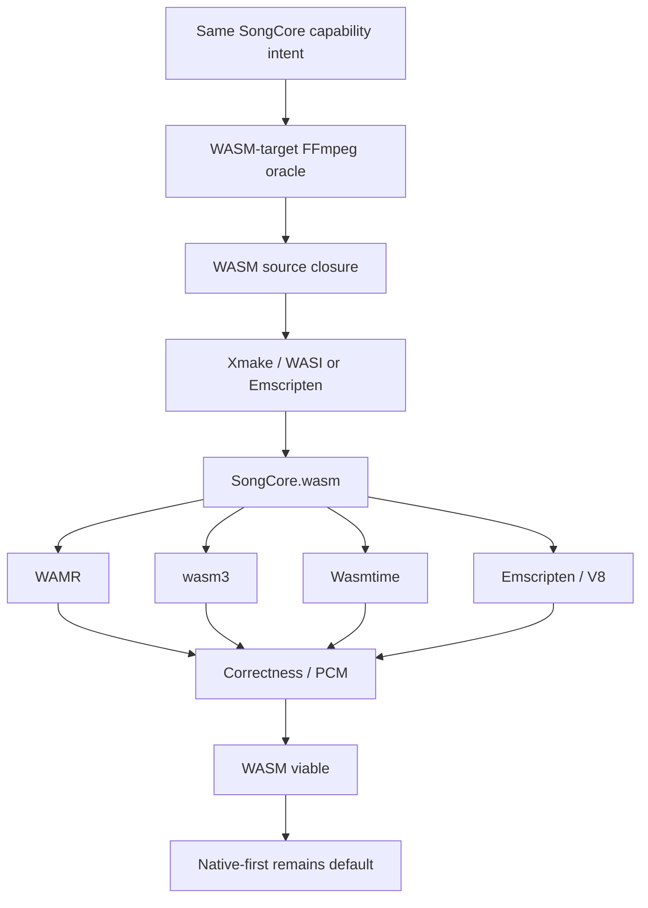

# WASM

Can the same trimmed SongCore run as WASM? Yes — and it was verified against
machine evidence. WASM is a documented future target, not the default path;
the architecture stays native-first.

## Architecture result

```text
SongCore C ABI  (include/songcore.h, frozen v1)
        ↓
WASM bridge     (src/wasm/songcore_wasm_bridge.c — host I/O imports, PCM export)
        ↓
SongCore.wasm
```

The same capability intent (`ffmpeg/capabilities/*.json`) and the same
configure-oracle → manifest → Xmake replay method produce the WASM closure;
only the toolchain differs. Nothing about SongCore itself is WASM-specific.



## Proven conclusions

Measured over 44 fixtures with the same ABI exercised from a native twin and
from WAMR (interpreter + AOT), wasm3, Wasmtime, and Emscripten/V8:

- **Correctness**: every WASM runtime produced matching SongCore behavior —
  28 bit-exact + 16 within the declared float tolerance (max abs delta
  1e-6), 0 rejected. Inter-runtime gate: PASS, 0 mismatches over 44 cases.
- **Interpreters carry a large runtime tax**: WAMR interpreter ≈ 41–76×
  slower than native; wasm3 ≈ 12–42×.
- **AOT/JIT approaches native-order performance**: WAMR AOT ≈ 0.72–1.27×,
  Wasmtime ≈ 1.01–1.85× (per-fixture execution tax vs the native twin).
- **Bridge (PCM transfer) tax**: WAMR AOT ≈ 17%, Wasmtime ≈ 4%,
  Emscripten/V8 ≈ 10% — the PCM copy across the boundary is small but not
  free; it shrinks relative to decode as decode cost grows.
- **Shipping size (xz -9e)**: native ≈ 1.51 MB raw / 581 KB xz; WASM guest
  ≈ 1.29 MB (same SongCore.wasm for WAMR/wasm3); WAMR AOT guest ≈ 3.55 MB
  raw. Native is the smallest artifact with zero runtime tax.

Durable machine summary: `bench/results/wasm-summary.json`. Full detail was
archived from the evaluation trees; git history preserves the raw runs.

## Why native-first remains the default

```text
same capability intent
  → native: smallest artifact, no runtime tax, direct C ABI
  → WASM:   viable, AOT/JIT close the gap, but a runtime and a bridge
            boundary are always present
```

WASM stays behind the same frozen ABI for a future embedder (web, plugin
sandbox, or portability experiment). The native build remains the shipping
default.
