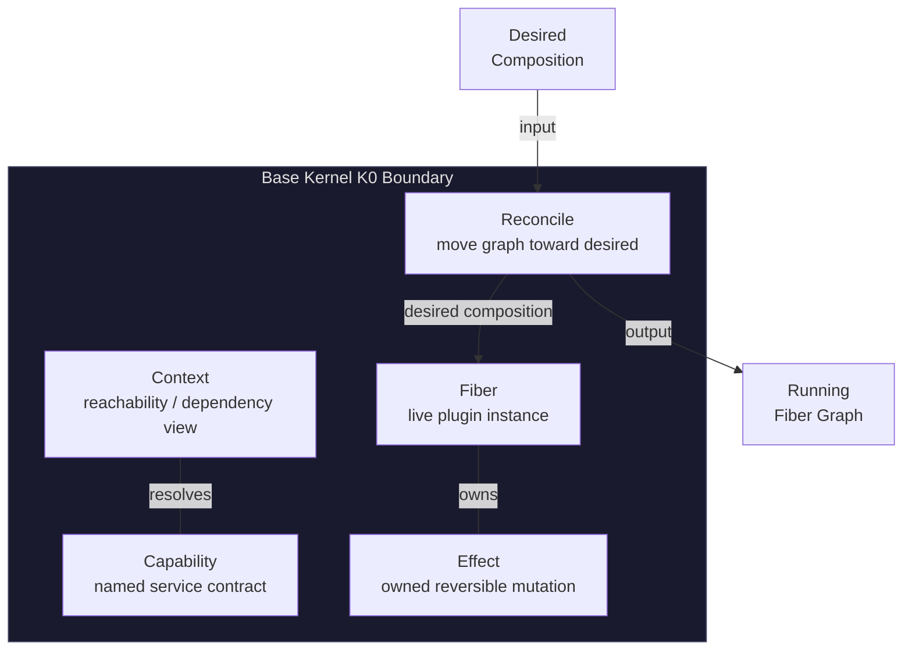

# Base Kernel K0

<StatusBadge status="IMPLEMENTED" />

The generic Composition Kernel implements five primitives — Context, Capability, Fiber, Effect, Reconcile — with 70 kernel oracle tests (75 workspace tests). It is domain-agnostic: it knows nothing about music, PCM, FFmpeg, WASAPI, PocketJS, KuiklyUI, or UI payload schemas.

---

## Five Primitives

---

## Kernel Constitution

<ClaimBadge role="authority" />

> **Kernel controls reachability, ownership and lifetime; it should not own application payloads.**

The kernel must not know:

- Track / playlist semantics
- PCM / codec formats
- FFmpeg / WASAPI
- PocketJS / KuiklyUI
- UI payload schemas
- Music commands

---

## What the Kernel Owns

| In Scope | Out of Scope |
|----------|-------------|
| Capability resolution | Track / session semantics |
| Fiber lifecycle | PCM buffers |
| Effect ownership & LIFO unwind | Audio output devices |
| Reconcile → running graph | UI payloads |
| Reachability / dependency validity | Codec selection |

---

## Formal Basis

<ClaimBadge role="authority" />

The design is backed by *A Programming Paradigm for Spatiotemporal Composability* (arXiv:2608.25512v1). Key theorems instantiated:

- **Thm 5/7** — Effects compose in twisted (LIFO-accumulating) order
- **Thm 15** — Local revertibility is per-application, not global
- **Thm 70** — Teardown-access window for provider withdrawal
- **Thm 73** — Quiescence/progress guarantee
- **Thm 80** — Confluence after legal composition history

### Effect Composition

The K0 Effect has exactly **one shape**: composition-lifecycle mutation with a total inverse. The five-label taxonomy (Reversible / Transactional / Compensatable / Irreversible / outside boundary) is a **descriptive action taxonomy**, not a kernel Effect variant.

Within one Fiber, owned effects unwind in **LIFO order**:

$$
g_2 \circ g_1 \circ \mathrm{id} \xrightarrow{\text{LIFO unwind}} g_1^{-1} \circ g_2^{-1}
$$

### Confluence

<ClaimBadge role="authority" />

After any legal load/unload/replacement history reaches quiescence:

$$
\mathcal{O}(\text{history} \rightarrow \text{quiescence}) = \mathcal{O}(\text{clean build of final desired composition})
$$

---

## Semantic Guarantees (Tested)

The implementation is validated by 70 kernel oracle tests across six groups:

| Guarantee | What it proves |
|-----------|---------------|
| Single-Fiber local cleanup | Owned effects unwind LIFO; fiber reaches terminal |
| Cross-Fiber independent removal | Removing A preserves independent B/C |
| Same-key contribution safety | Contributions compose without hidden cross-key mutation |
| Ordered interaction | Non-commutative relations use explicit structure |
| Provider-disappearance ordering | Dependents finish teardown before provider release |
| Confluence | History → quiescence ≡ clean build |

---

## Implementation Status

| Artifact | Status |
|----------|--------|
| `crates/qianqian-kernel` | Implemented |
| Test count | 70 kernel (75 workspace) |
| Tests pass | At merge (743eb86) |
| Adversarial oracles | A1–A21 |

<ProvenancePanel
  :authority="['docs/architecture/composition-kernel-0-design.md', 'docs/architecture/composition-kernel-0-implementation-adr.md']"
  :decisions="[{ issue: 67 }, { pr: 68 }, { pr: 69 }]"
  :implementation="[{ issue: 70 }, { pr: 71 }]"
  :evidence="['crates/qianqian-kernel/tests']"
  lastVerified="743eb86"
/>
