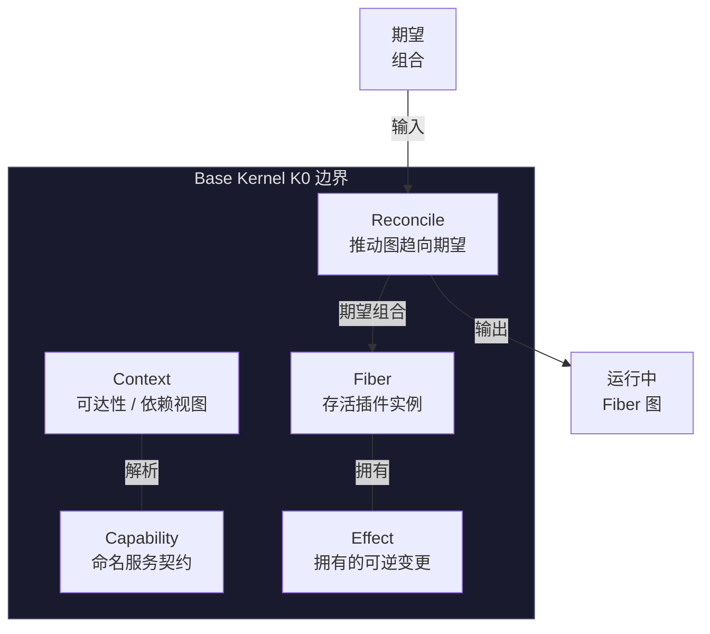

# Base Kernel K0

<StatusBadge status="IMPLEMENTED" />

通用 Composition Kernel 实现五个原语 —— Context、Capability、Fiber、Effect、Reconcile —— 70 项内核 oracle 测试(75 项 workspace 测试)。它领域无关:不了解音乐、PCM、FFmpeg、WASAPI、PocketJS、KuiklyUI 或 UI 载荷 schema。

---

## 五个原语

---

## 内核宪章

<ClaimBadge role="authority" />

> **内核控制可达性、所有权与生命周期;它不拥有应用载荷。**

内核不得了解:

- 曲目 / 播放列表语义
- PCM / 编解码格式
- FFmpeg / WASAPI
- PocketJS / KuiklyUI
- UI 载荷 schema
- 音乐命令

---

## 内核拥有什么

| 范围内 | 范围外 |
|--------|--------|
| 能力解析 | 曲目 / 会话语义 |
| Fiber 生命周期 | PCM 缓冲 |
| Effect 所有权与 LIFO 展开 | 音频输出设备 |
| Reconcile → 运行图 | UI 载荷 |
| 可达性 / 依赖有效性 | 编解码器选择 |

---

## 形式化基础

<ClaimBadge role="authority" />

设计由论文 *A Programming Paradigm for Spatiotemporal Composability*(arXiv:2608.25512v1)支撑。已实例化的关键定理:

- **Thm 5/7** — Effect 按 twisted(LIFO 累积)顺序组合
- **Thm 15** — 局部可逆性是逐次应用的,而非全局
- **Thm 70** — 提供者撤回的 teardown 访问窗口
- **Thm 73** — 静息/推进保证
- **Thm 80** — 合法组合历史后的合流性

### Effect 组合

K0 Effect 恰好有**一种形态**:带全逆算子的组合生命周期变更。五标签分类法(Reversible / Transactional / Compensatable / Irreversible / 边界外)是**描述性行动分类**,不是内核 Effect 变体。

在单个 Fiber 内,拥有的 Effect 按 **LIFO 顺序**展开:

$$
g_2 \circ g_1 \circ \mathrm{id} \xrightarrow{\text{LIFO 展开}} g_1^{-1} \circ g_2^{-1}
$$

### 合流性

<ClaimBadge role="authority" />

任何合法的加载/卸载/替换历史到达静息态后:

$$
\mathcal{O}(\text{历史} \rightarrow \text{静息态}) = \mathcal{O}(\text{最终期望组合的全新构建})
$$

---

## 语义保证(已测试)

实现由六组共 70 项内核 oracle 测试验证:

| 保证 | 证明内容 |
|------|---------|
| 单 Fiber 局部清理 | 拥有的 Effect 按 LIFO 展开;fiber 到达终态 |
| 跨 Fiber 独立移除 | 移除 A 保留独立的 B/C |
| 同键贡献安全 | 贡献组合无隐藏跨键变更 |
| 有序交互 | 非可交换关系使用显式结构 |
| 提供者消失排序 | 依赖方在提供者释放前完成 teardown |
| 合流性 | 历史 → 静息态 ≡ 全新构建 |

---

## 实现状态

| 制品 | 状态 |
|------|------|
| `crates/qianqian-composition` | 已实现 |
| 测试数量 | 70 内核(75 workspace) |
| 测试通过 | 合并时 (743eb86) |
| 对抗性 oracle | A1–A21 |

<ProvenancePanel
  :authority="['docs/architecture/composition-kernel-0-design.md', 'docs/architecture/composition-kernel-0-implementation-adr.md']"
  :decisions="[{ issue: 67 }, { pr: 68 }, { pr: 69 }]"
  :implementation="[{ issue: 70 }, { pr: 71 }]"
  :evidence="['crates/qianqian-composition/tests']"
  lastVerified="743eb86"
/>
