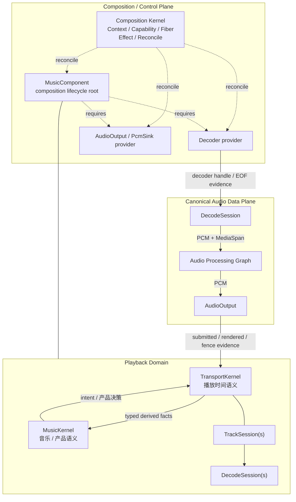

# 架构总览

Qianqian Architecture v2 是一个面向本地优先音乐播放器的、边界优先、面向组合的运行时架构。

> **Composition Kernel 控制可达性、组合所有权与生命周期；它不拥有应用载荷。**

同时：

> **每个语义事实只有一个 semantic authority。**

---

## 架构宪章

<ClaimBadge role="authority" />

- **Capabilities 暴露契约；providers 拥有机制。**
- **Fibers 拥有插件实例生命周期。**
- **Effects 记录可归因的组合变更/恢复溯源。**
- **Profile 声明期望组合；Reconcile 决定运行中的 Fiber 图。**
- **Playback 的产品语义与时间语义不属于 generic Composition Kernel。**

---

## 系统总览



---

## 三种不要混淆的关系

```text
MusicComponent   = composition lifecycle root
MusicKernel      = music/product semantic authority
TransportKernel  = playback temporal authority
```

> 这一 playback 拆分来自 ADR-PBK-001（**PROPOSED / FORMAL CORE PASS**）；在人工 ACCEPTED 并更新 registry 前，它是 ARCH-003 的拟议替代模型，而非已迁移的登记 authority。

`Kernel` 在后两个名字里表示 semantic authority role，不代表两个新的 Composition plugin。

Nested playback lifetime：

```text
MusicComponent
├── MusicKernel
├── TransportKernel
└── TrackSession(s)
    └── DecodeSession(s)
```

---

## 控制平面 != 数据平面

<ClaimBadge role="authority" />

> **Capability Plane != Data Plane。**

Context 建立可达性与依赖真相；绑定后，载荷通过服务或预绑定数据边直接流动。

```text
Encoded Media → Decoder → Canonical PCM → Audio Processing Graph → AudioOutput
```

Realtime callback 内不允许 Context 查找、能力解析、Fiber Reconcile、通用事件派发、文件/网络 I/O、UI 往返或无界阻塞/分配。

---

## Playback 时间正确性

MVP temporal shape：

```text
1 Active
0..1 Prepared
```

Active 与 Prepared 可以属于不同 Generation。因此：

```text
result.generation != global_current_generation => stale
```

是错误模型。

Generation 是否有效取决于对应 temporal role 的 admission。

同时保留：

```text
decoded != queued != submitted != rendered
logical invalidation != physical stop
```

需要杀死旧 submitted audio 的 hard discontinuity 必须经过 Physical Fence。

---

## Composition Graph != Processing Graph

Composition graph 管 provider / capability / Fiber / lifecycle。

Audio Processing Graph 管有顺序的 PCM transform：

```text
Gain → EQ → SRC → Limiter → ...
```

普通 DSP node 不会因为“有状态”就自动成为 Composition plugin。

---

## 当前状态

| 架构块 | 状态 |
|---|---|
| Base / Composition Kernel K0 | <StatusBadge status="IMPLEMENTED" /> |
| Playback Architecture / ADR-PBK-001 | <StatusBadge status="PROPOSED" /> `FORMAL CORE PASS` |
| Decoder provider | <StatusBadge status="PLANNED" /> |
| AudioOutput provider | <StatusBadge status="PLANNED" /> |
| Audio Processing implementation | <StatusBadge status="PLANNED" /> |
| UiHost | <StatusBadge status="DEFERRED" /> |

Playback 代码目前只建立 `MusicKernel` / `TransportKernel` 的 authority shell；FFmpeg/WASAPI 和完整 playback state machine 尚未因此获得实现事实。

---

## 形式化验证边界

> **TLA+ 用来找撞车，不用来证明整个架构。**

Blocking core 只覆盖真正高风险的 temporal collisions：Dual Window、Generation admission、Physical Fence、submitted/rendered、EOF/drained/ENDED。

---

<ProvenancePanel
  :authority="['docs/architecture/overview.md', 'docs/adr/ADR-PBK-001.md', 'docs/architecture/composition-kernel.md']"
  :decisions="[{ issue: 67 }, { pr: 68 }, { pr: 78 }, { pr: 79 }]"
  :implementation="[{ issue: 70 }, { pr: 71 }]"
  :evidence="['crates/qianqian-kernel/tests', 'specs/playback/PlaybackTemporal.tla']"
/>
