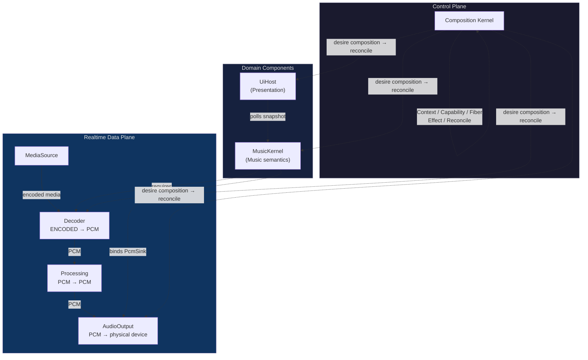
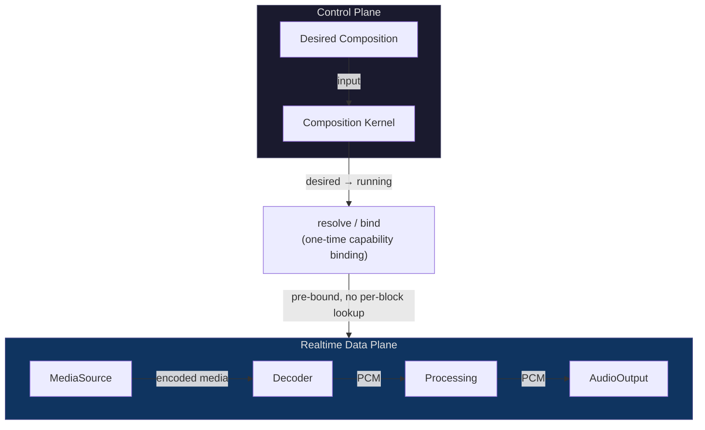

# Architecture Overview

Qianqian Architecture v2 is a boundary-first, composition-oriented plugin architecture for a local-first music player.

> **Kernel controls reachability, ownership and lifetime; it should not own application payloads.**

---

## Architecture Constitution

<ClaimBadge role="authority" /> These principles are frozen. They cannot be changed by Observatory prose.

- **Domain kernels own domain semantics.**
- **Capabilities expose contracts; providers own mechanisms.**
- **Fibers own plugin-instance lifetime.**
- **Effects own attributable mutation/recovery provenance.**
- **Profiles declare desired composition; Reconcile determines the running graph.**

---

## Boundary-First Design

The architecture question is not "how should `ctx.effect()` look?" It is:

> How should the product be decomposed so that ownership, dependencies, interactions, ordering and recovery boundaries are explicit enough for composability to mean something?

Design order:

```text
Component Granularity
        ↓
Capability / dependency boundary
        ↓
Interaction Algebra
        ↓
Effect / System Boundary
        ↓
Global lifecycle ordering
        ↓
Confluence oracle
        ↓
Composition Kernel implementation
```

---

## System Overview

<ClaimBadge role="interpretation" /> This diagram shows the intended system topology.



| Component | Data Transformation | Status |
|-----------|-------------------|--------|
| Base Kernel | Context / Capability / Fiber / Effect / Reconcile | <StatusBadge status="IMPLEMENTED" /> |
| Decoder | Encoded media → PCM | <StatusBadge status="PLANNED" /> |
| Processing | PCM → PCM | <StatusBadge status="PLANNED" /> |
| AudioOutput | PCM → physical device | <StatusBadge status="PLANNED" /> |
| Playback Kernel | Music domain semantics | <StatusBadge status="NEXT" /> |
| UI Host | Presentation | <StatusBadge status="DEFERRED" /> |

---

## Control Plane vs Data Plane

<ClaimBadge role="authority" />

> **Capability plane != Data plane.**

Context establishes reachability. It does not carry PCM blocks or application payloads.



The realtime audio path is a data-plane island. Per callback/block it must not perform Context lookup, capability resolution, Fiber reconciliation, arbitrary event dispatch, filesystem/network I/O, or UI round trips.

---

## Interaction Algebra

<ClaimBadge role="authority" />

$$
\text{Commutative relation} \rightarrow \text{may compose as independent effects}
$$

$$
\text{Non-commutative relation} \rightarrow \text{explicit dependency/order structure}
$$

DSP/pipeline ordering is the canonical example. EQ → Compressor is generally not equivalent to Compressor → EQ. Registration timing, mount timing, and iteration order must never silently become product semantics.

---

## Confluence

<ClaimBadge role="authority" />

> After any legal load/unload/replacement history reaches quiescence, the observable runtime is equivalent to a clean construction of the final desired composition.

This tests far more than "did not crash": it detects ghost bindings, stale lifecycle state, leaked contributions, and history-dependent composition.

---

## Five Primitives

The Composition Kernel K0 is centered on exactly five primitives:

| Primitive | Role |
|-----------|------|
| **Context** | Capability namespace / dependency view; controls reachability |
| **Capability** | Named/typed service contract; identity distinct from provider |
| **Fiber** | Live plugin instance with identity, scope, requirements, lifecycle |
| **Effect** | Owned reversible mutation with total inverse, LIFO unwind |
| **Reconcile** | Moves running Fiber graph toward desired composition |

Do not add a sixth primitive without demonstrating these five cannot express a required invariant.

---

<ProvenancePanel
  :authority="['docs/architecture/overview.md', 'docs/architecture/composition-kernel.md']"
  :decisions="[{ issue: 46 }, { issue: 53 }, { issue: 67 }]"
  :implementation="[{ issue: 70 }, { pr: 71 }]"
  :evidence="['crates/qianqian-kernel/tests']"
  lastVerified="743eb86"
/>
