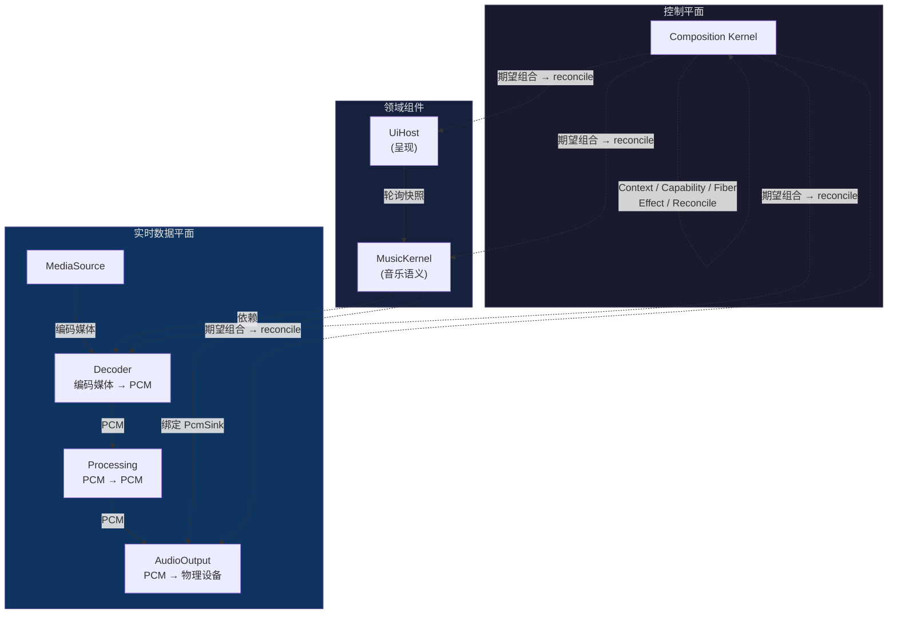
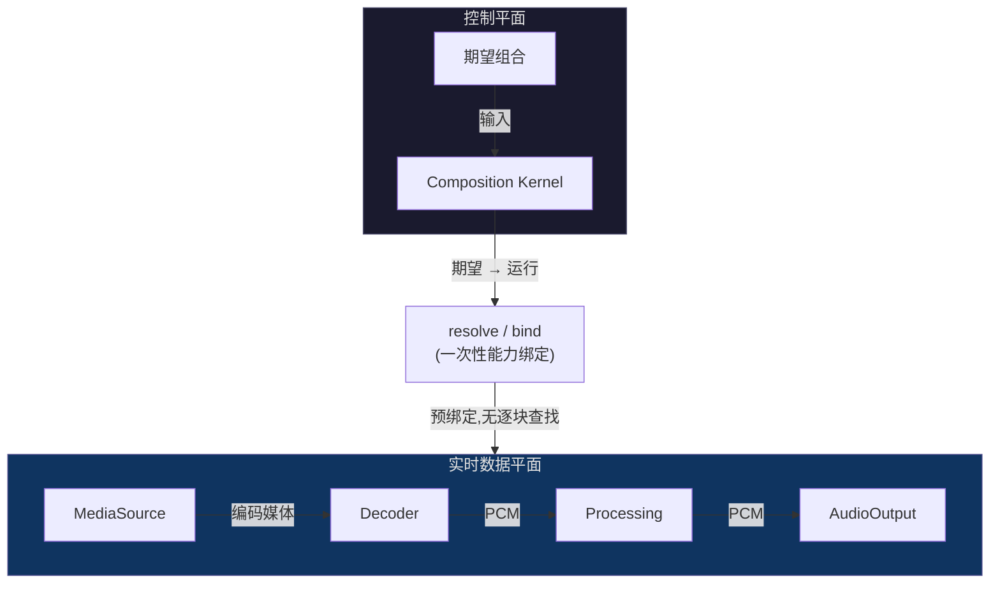

# 架构总览

Qianqian Architecture v2 是一个面向本地优先音乐播放器的、边界优先、面向组合的插件架构。

> **内核控制可达性、所有权与生命周期;它不拥有应用载荷。**

---

## 架构宪章

<ClaimBadge role="authority" /> 这些原则已冻结。观测站的文章不能更改它们。

- **领域内核拥有领域语义。**
- **能力暴露契约;提供者拥有机制。**
- **Fiber 拥有插件实例生命周期。**
- **Effect 拥有可归因的变更/恢复溯源。**
- **Profile 声明期望组合;Reconcile 决定运行中的图。**

---

## 边界优先设计

架构问题不是"`ctx.effect()` 应该长什么样?"而是:

> 产品应如何分解,才能让所有权、依赖、交互、排序与恢复边界足够显式,使"可组合"真正有意义?

设计顺序:

```text
组件粒度
        ↓
能力 / 依赖边界
        ↓
交互代数
        ↓
Effect / 系统边界
        ↓
全局生命周期排序
        ↓
合流性 oracle
        ↓
Composition Kernel 实现
```

---

## 系统总览

<ClaimBadge role="interpretation" /> 此图展示的是目标系统拓扑。



| 组件 | 数据变换 | 状态 |
|------|---------|------|
| Base Kernel | Context / Capability / Fiber / Effect / Reconcile | <StatusBadge status="IMPLEMENTED" /> |
| Decoder | 编码媒体 → PCM | <StatusBadge status="PLANNED" /> |
| Processing | PCM → PCM | <StatusBadge status="PLANNED" /> |
| AudioOutput | PCM → 物理设备 | <StatusBadge status="PLANNED" /> |
| Playback Kernel | 音乐领域语义 | <StatusBadge status="NEXT" /> |
| UI Host | 呈现 | <StatusBadge status="DEFERRED" /> |

---

## 控制平面与数据平面

<ClaimBadge role="authority" />

> **能力平面 != 数据平面。**

Context 建立可达性。它不承载 PCM 数据块或应用载荷。



实时音频路径是数据平面孤岛。在每个回调/数据块内,它不得执行 Context 查找、能力解析、Fiber 调和、任意事件派发、文件系统/网络 I/O 或 UI 往返。

---

## 交互代数

<ClaimBadge role="authority" />

$$
\text{可交换关系} \rightarrow \text{可作为独立 Effect 组合}
$$

$$
\text{非可交换关系} \rightarrow \text{显式依赖/排序结构}
$$

DSP/流水线排序是典型例子。EQ → Compressor 一般不等价于 Compressor → EQ。注册时机、挂载时机与迭代顺序绝不能悄悄变成产品语义。

---

## 合流性(Confluence)

<ClaimBadge role="authority" />

> 任何合法的加载/卸载/替换历史到达静息态后,可观测运行时等价于对最终期望组合的一次全新构建。

它检验的远不止"没有崩溃":它能发现幽灵绑定、过期的生命周期状态、泄漏的贡献以及依赖历史的组合。

---

## 五个原语

Composition Kernel K0 恰好以五个原语为中心:

| 原语 | 角色 |
|------|------|
| **Context** | 能力命名空间/依赖视图;控制可达性 |
| **Capability** | 命名/类型化的服务契约;身份独立于提供者 |
| **Fiber** | 拥有身份、作用域、需求与生命周期的存活插件实例 |
| **Effect** | 拥有全逆算子的可逆变更,LIFO 展开 |
| **Reconcile** | 将运行中的 Fiber 图推向期望组合 |

在未证明这五个原语无法表达某个必需不变量之前,不得添加第六个原语。

---

<ProvenancePanel
  :authority="['docs/architecture/overview.md', 'docs/architecture/composition-kernel.md']"
  :decisions="[{ issue: 46 }, { issue: 53 }, { issue: 67 }]"
  :implementation="[{ issue: 70 }, { pr: 71 }]"
  :evidence="['crates/qianqian-kernel/tests']"
  lastVerified="743eb86"
/>
