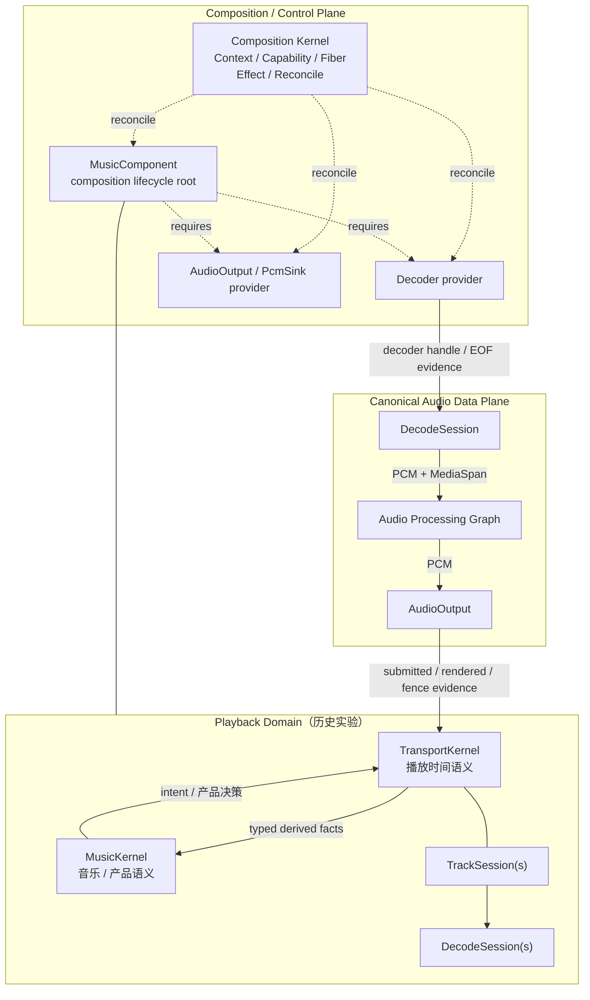

# 架构总览

> **Playback Foundations reset（2026-09）：** 本页 mermaid 图与下文中的 `MusicComponent` / `MusicKernel` / `TransportKernel` / `TrackSession` / `DecodeSession` 内容是**历史实验证据**，不再是 current authority。当前 Playback Foundations authority 是 `docs/adr/ADR-PBK-001.md`（**ACCEPTED**，不冻结播放状态机名词）。

当前静态 Plugin/Fiber 组合与最小播放语义由 PBK-002（ACCEPTED）定义，Output/backend 边界由 PBK-003（ACCEPTED）定义。当前执行阅读入口是 [playback execution model](https://github.com/jnhu76/qianqian/blob/main/docs/architecture/playback-execution-model.md)：C1/C2 已合并，Stage 5 #208 明确表达 Stage-4 merged candidate；D1–D6 已由 #209 ACCEPT、#210 FROZEN（绑定 #212 验证契约），§1 路由各 owning authority，§12 保留 20/20 minimum-core traceability。本页是派生摘要，历史图不描述当前实现。

Qianqian Architecture v2 是一个面向本地优先音乐播放器的、边界优先、面向组合的运行时架构。

> **Composition Kernel 控制可达性、组合所有权与生命周期；它不拥有应用载荷。**

同时：

> **同一 (fact kind, semantic subject scope) 在同一时刻只有一个 designated semantic authority。**（ADR-PBK-001 §2.3 摘要；不是"每个事实一个全局 authority"。）

---

## 架构宪章

<ClaimBadge role="authority" />

- **Capabilities 暴露契约；providers 拥有机制。**
- **Fibers 拥有插件实例生命周期。**
- **Effects 记录可归因的组合变更/恢复溯源。**
- **Profile 声明期望组合；Reconcile 决定运行中的 Fiber 图。**
- **Playback 的产品语义与时间语义不属于 generic Composition Kernel。**

---

## 系统总览



---

## 历史实验中的 playback 拆分（非 current authority）

```text
MusicComponent   = composition lifecycle root        （历史实验）
MusicKernel      = music/product semantic authority  （历史实验）
TransportKernel  = playback temporal authority       （历史实验）
```

> 这一 playback 拆分来自旧版 ADR-PBK-001 修订；2026-09 架构重置后，它与本页其余 playback-specific 名词一样只是 **experimental evidence**。当前 Playback Foundations（ACCEPTED）不冻结任何 playback 状态机名词。

`Kernel` 在后两个名字里表示 semantic authority role，不代表两个新的 Composition plugin；这一命名习惯本身也只是历史证据。

Nested playback lifetime：

```text
MusicComponent
├── MusicKernel
├── TransportKernel
└── TrackSession(s)
    └── DecodeSession(s)
```

---

## 控制平面 != 数据平面

<ClaimBadge role="authority" />

> **Capability Plane != Data Plane。**

Context 建立可达性与依赖真相；绑定后，载荷通过服务或预绑定数据边直接流动。

```text
Encoded Media → Decoder → Canonical PCM → Audio Processing Graph → AudioOutput
```

Realtime callback 内不允许 Context 查找、能力解析、Fiber Reconcile、通用事件派发、文件/网络 I/O、UI 往返或无界阻塞/分配。

---

## 历史 Playback temporal evidence（非 current authority）

以下 `Active` / `Prepared` / `Generation` / `Physical Fence` 等 temporal 词汇全部来自旧实验模型，属于 **experimental evidence**。当前 ADR-PBK-001（ACCEPTED）未冻结任何 playback 状态机名词——这些旧实验暴露过有价值的 failure witnesses，但具体 temporal vocabulary / mechanism 均需未来实验重新挣得：

旧实验的 MVP temporal shape：

```text
1 Active
0..1 Prepared
```

Active 与 Prepared 可以属于不同 Generation。因此：

```text
result.generation != global_current_generation => stale
```

是错误模型。

Generation 是否有效取决于对应 temporal role 的 admission。

同时保留：

```text
decoded != queued != submitted != rendered
logical invalidation != physical stop
```

需要杀死旧 submitted audio 的 hard discontinuity 必须经过 Physical Fence。

---

## Composition Graph != Processing Graph

Composition graph 管 provider / capability / Fiber / lifecycle。

Audio Processing Graph 管有顺序的 PCM transform：

```text
Gain → EQ → SRC → Limiter → ...
```

普通 DSP node 不会因为“有状态”就自动成为 Composition plugin。

---

## 当前状态

| 架构块 | 状态 |
|---|---|
| Base / Composition Kernel K0 | <StatusBadge status="IMPLEMENTED" /> |
| Playback Foundations / ADR-PBK-001 | <StatusBadge status="CURRENT" /> `ACCEPTED` — 旧 playback 名词为 historical evidence（Git 历史存档） |
| Decode Plugin / Decoder | <StatusBadge status="IMPLEMENTED" /> SongCore-backed provider；PBK-002 D6/D14 |
| Output Plugin / AudioOutput | <StatusBadge status="IMPLEMENTED" /> backend-neutral contract，当前 owned WASAPI mechanism；PBK-003 |
| Episode-owned Audio Processing | <StatusBadge status="IMPLEMENTED" /> Gain + 10-band EQ / live update；PBK-002 D14.11、DSP product model §7.3 |
| Playback execution model | <StatusBadge status="CURRENT" /> FROZEN（#210）；C1 #205、C2 #213 已合并，D1–D6 已由 #209 ACCEPT |
| UiHost | <StatusBadge status="DEFERRED" /> |

旧 playback 实验代码及其 test-local executable traces 已随 post-#139 spec reset 从 main 移除（Git 历史存档），不是 current authority；仍在验证的竞态由当前 specs/tests 承载（`specs/README.md`）。当前 decode/PCM/output 与已挣得的最小播放语义已有实现；更广的播放状态机、未挣得的 Plugin 与机制仍须 authority review。上述实现状态不构成设备或跨平台运行验证。

---

## 形式化验证边界

> **TLA+ 用来找撞车，不用来证明整个架构。**

旧 playback formal core（历史 blocking 定位已退役）覆盖过这些 temporal collisions：Dual Window、Generation admission、Physical Fence、submitted/rendered、EOF/drained/ENDED；现为 experimental evidence。

---

<ProvenancePanel
  :authority="['docs/adr/ADR-PBK-001.md', 'docs/adr/ADR-PBK-002.md', 'docs/adr/ADR-PBK-003.md', 'docs/architecture/composition-kernel-0-design.md', 'docs/architecture/playback-execution-model.md']"
  :decisions="[{ issue: 67 }, { pr: 68 }]"
  :implementation="[{ issue: 70 }, { pr: 71 }]"
  :evidence="['crates/qianqian-composition/tests', 'specs/composition-kernel-0/CompositionKernel0.tla']"
/>
