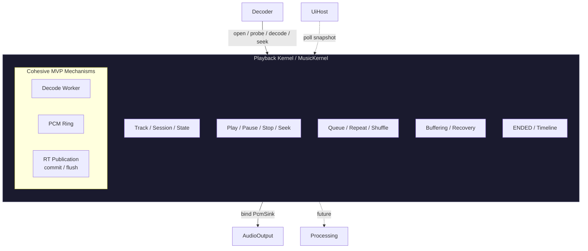

# Playback Kernel

<StatusBadge status="NEXT" />

The Playback Kernel (MusicKernel) is the music-domain semantic authority. It is **not** the global composition authority.

---

## Domain Semantics

<ClaimBadge role="authority" />

MusicKernel owns:

- Playback state machine (EMPTY/READY/PLAYING/PAUSED/ENDED/ERROR)
- Media-timeline truth (position/duration μs, CONFIRMED/ESTIMATED landing, GAP = zero media time)
- Active track session (including open Decoder handle)
- Queue semantics (future)
- State-machine transitions; seek-landing vs ENDED

---

## Ownership Split

<ClaimBadge role="authority" /> **Frozen in component-boundary-a0.md §B.1.**

| Owned by Music *component* | Owned by MusicKernel |
|---------------------------|---------------------|
| Domain semantics + cohesive MVP mechanisms | Domain semantics only |
| Session / worker / ring / timeline mechanism | State-machine meaning |
| RT publication boundary | Track/session/ENDED meaning |
| | Timeline interpretation |

`MusicKernel` must **never** contain `struct MusicKernel { worker, ring, renderer_handle }` — that would contradict "domain kernels own domain semantics."

---

## Dependencies

| Requires | Cardinality | Purpose |
|----------|------------|---------|
| Decoder | 1 | Open / probe / decode / seek / EOF |
| PcmSink (from AudioOutput) | 1 | Bind / negotiate, RT fill endpoint |

Unsatisfied requirement → component stays inactive/degraded. It never crashes the root.

---

## Activation Rule

<ClaimBadge role="authority" /> Frozen.

Music binds `PcmSink` at **activation** (not at track open). SinkSession existence follows solely from the live binding:

$$
\text{SinkSession exists} \iff \text{live binding}
$$

idle ≠ absent. Track open/close changes what flows through the session, never whether it exists.

---

## Observable Contract

State; position/duration on the MEDIA timeline; landing quality; buffered/underrun diagnostics; typed errors with Decoder verdict attribution. Frozen from `pe_snapshot`.

---

## System Boundary

Audio actually rendered by the sink is **outside rollback**:

$$
\text{submitted} \neq \text{rendered}
$$

Claimed physical flush is irreversible. Host-IO side effects during decode belong to the host, not to Music.

---

<ProvenancePanel
  :authority="['docs/architecture/component-boundary-a0.md §B.1', 'docs/architecture/overview.md']"
  :decisions="[{ issue: 53 }, { pr: 66 }]"
  :evidence="['research/playback-reference-v1']"
/>
