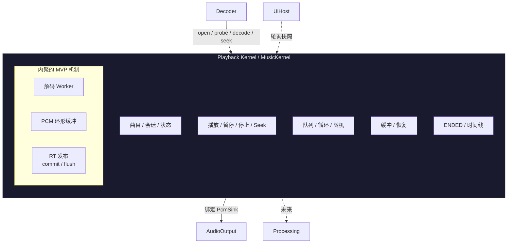

# Playback Kernel

<StatusBadge status="NEXT" />

Playback Kernel(MusicKernel)是音乐领域语义权威。它**不是**全局组合权威。

---

## 领域语义

<ClaimBadge role="authority" />

MusicKernel 拥有:

- 播放状态机(EMPTY/READY/PLAYING/PAUSED/ENDED/ERROR)
- 媒体时间线真相(position/duration μs、CONFIRMED/ESTIMATED 落点、GAP = 零媒体时间)
- 活动曲目会话(含打开的 Decoder 句柄)
- 队列语义(未来)
- 状态机转换;seek 落点 vs ENDED

---

## 所有权切分

<ClaimBadge role="authority" /> **冻结于 component-boundary-a0.md §B.1。**

| Music *组件*拥有 | MusicKernel 拥有 |
|------------------|------------------|
| 领域语义 + 内聚 MVP 机制 | 仅领域语义 |
| 会话/worker/环形缓冲/时间线机制 | 状态机含义 |
| RT 发布边界 | 曲目/会话/ENDED 含义 |
| | 时间线解释 |

`MusicKernel` **绝不**能包含 `struct MusicKernel { worker, ring, renderer_handle }` —— 那将违背"领域内核拥有领域语义"。

---

## 依赖

| 依赖 | 基数 | 用途 |
|------|------|------|
| Decoder | 1 | 打开 / 探测 / 解码 / seek / EOF |
| PcmSink(来自 AudioOutput) | 1 | 绑定 / 协商,RT 填充端点 |

需求未满足 → 组件保持 inactive/degraded。它绝不会让根崩溃。

---

## 激活规则

<ClaimBadge role="authority" /> 已冻结。

Music 在**激活时**绑定 `PcmSink`(不是在曲目打开时)。SinkSession 的存在仅由存活绑定决定:

$$
\text{SinkSession 存在} \iff \text{存活绑定}
$$

idle ≠ 不存在。曲目打开/关闭改变流经会话的内容,从不改变它是否存在。

---

## 可观测契约

状态;媒体时间线上的 position/duration;落点质量;缓冲/欠载诊断;带 Decoder 判定归因的类型化错误。自 `pe_snapshot` 冻结。

---

## 系统边界

sink 实际渲染出的音频**在回滚之外**:

$$
\text{submitted} \neq \text{rendered}
$$

已提交的物理 flush 不可逆。解码期间的 Host-IO 副作用属于宿主,不属于 Music。

---

<ProvenancePanel
  :authority="['docs/architecture/component-boundary-a0.md §B.1', 'docs/architecture/overview.md']"
  :decisions="[{ issue: 53 }, { pr: 66 }]"
  :evidence="['research/playback-reference-v1']"
/>
