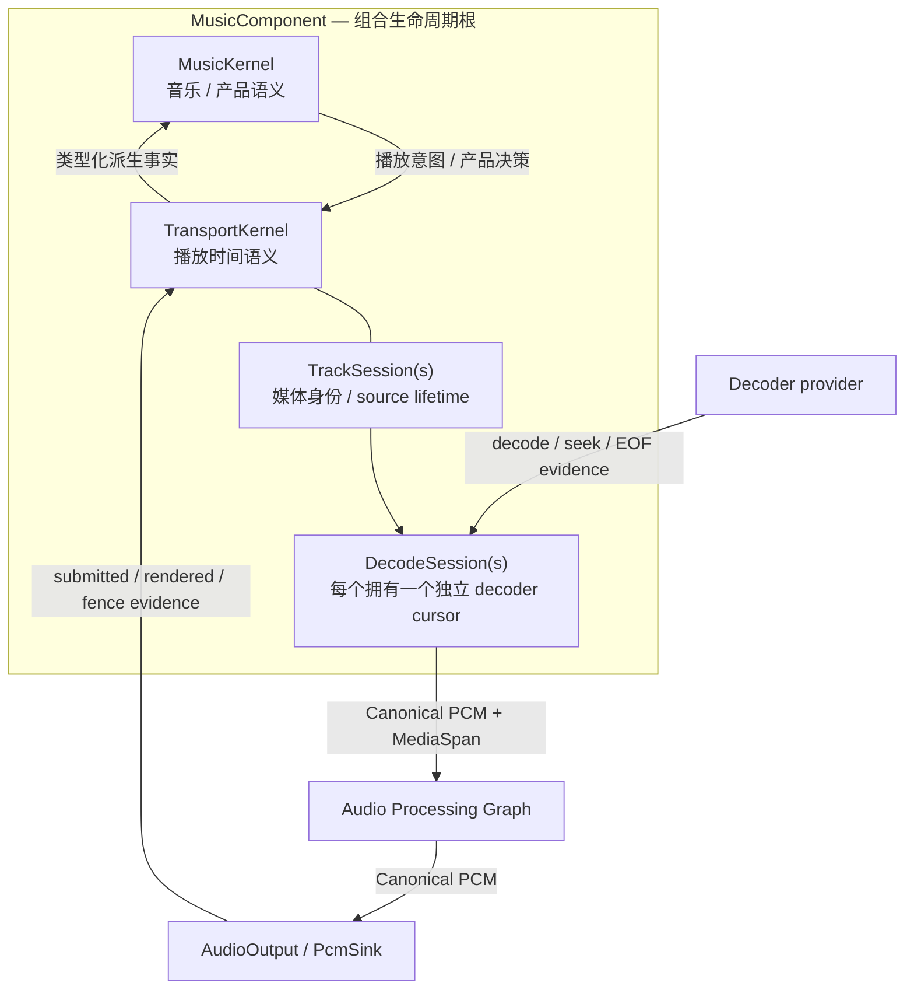

# Playback Architecture

<StatusBadge status="HISTORICAL_EVIDENCE" />

> **STATUS: HISTORICAL / EXPERIMENTAL EVIDENCE**
>
> 本页描述的 `MusicComponent` / `MusicKernel` / `TransportKernel` / `TrackSession` / `DecodeSession` / Generation / Dual Window / Physical Fence 模型来自旧 Playback 架构实验（含其短暂 ACCEPTED 的旧版 ADR 修订）。2026-09 播放架构从第一性原理重置后，这些内容**不再是 current authority**，也不是新 Playback 设计的 acceptance gate。当前 Playback Foundations authority：`docs/adr/ADR-PBK-001.md`（**ACCEPTED**，不冻结播放状态机名词）。本页保留作为面向阅读的历史解释层与 failure-witness 索引。

以下为历史内容（原样保留，仅状态降级）：

> **Playback 不是一个巨型 MusicKernel。**

---

## 三个不同的角色

<ClaimBadge role="evidence" />

```text
MusicComponent   = 组合生命周期根
MusicKernel      = 音乐 / 产品语义权威
TransportKernel  = 播放时间语义权威
```



`Kernel` 在 `MusicKernel` / `TransportKernel` 中表示 **semantic authority role**，不表示它们各自是 Composition plugin。

---

## MusicKernel 管什么

MusicKernel 负责**产品意义**：

- play / pause 的产品语义
- seek intent 的产品意义
- next / previous
- repeat / shuffle
- playlist policy
- 当前选择语义
- 用户可见 `PlaybackState` 的意义
- Transport 给出 terminal outcome 后，是 next / repeat / stop

MusicKernel **不拥有**：

```text
playback cursor
Active / Prepared role
Generation admission
Physical Fence state
raw submitted / rendered / EOF evidence
```

---

## TransportKernel 管什么

TransportKernel 是唯一 playback temporal authority：

- playback cursor / MediaSpan timeline
- `Active` / `Prepared` temporal roles
- Generation admission
- window promotion / invalidation
- discontinuity execution
- Physical Fence 协调
- raw playback evidence 的解释

Decoder EOF、seek landing、late decode result、submitted/rendered evidence、Physical Fence verdict 都先进入 TransportKernel；其他 authority 只接收派生后的类型化事实。

---

## TrackSession 与 DecodeSession

`TrackSession` 是媒体身份/source lifetime root，不等于一个唯一 decoder cursor。

一个 TrackSession 可以同时拥有多个 DecodeSession：

```text
TrackSession A
├── DecodeSession gen17 @72s   -> Active
└── DecodeSession gen18 @100s  -> Prepared
```

每个 DecodeSession 拥有一个独立推进的 decoder cursor/handle。

这使 same-track seek 可以一边维持当前 Active，一边准备新的 Prepared，而不是先摧毁旧时间轴再赌博式 seek。

---

## Dual Window 与 Generation Admission

MVP 固定：

```text
1 Active
0..1 Prepared
```

因此下面的经典写法是错误的：

```text
result.generation != global_current_generation => stale
```

Prepared generation 与 Active generation 同时存在是合法状态。

Generation 是否 stale 取决于：

> **该 temporal role 是否仍然 admission 这个操作。**

而不是是否等于一个全局 current generation。

---

## Physical Fence

<ClaimBadge role="evidence" />

```text
decoded != queued != submitted != rendered
logical invalidation != physical stop
```

hard stop / seek commit / hard replacement 在必须杀死旧 submitted audio 时，要经过 Physical Fence：

```text
关闭旧 admission
        ↓
阻止旧 generation 新提交
        ↓
Physical Fence / flush handshake
        ↓
definitive verdict
        ↓
promote / stop / fail closed
```

Generation retirement 不能替代物理切断。

Fence 一旦进入 claimed / 不可逆阶段，后来的 intent 不得取消或改写已经 claim 的 physical transaction。

形式化探索还抓到过一个真实竞态：stop fence 在途时，自然 EOF/drain 如果抢先 ENDED 并销毁 Active temporal state，会让 fence 永久无法完成。因此：

> **在途 Physical Fence 所需的 active temporal state 不得被自然终态化提前销毁。**

---

## PCM 数据面

Canonical audio data plane：

```text
Encoded Media
    → Decoder
    → Canonical PCM
    → Audio Processing Graph
    → AudioOutput
```

Composition topology 与 Audio Processing Graph 是两张不同的图。Gain / EQ / SRC / Limiter 节点不会仅因为有状态就自动成为 Fiber/plugin。

---

## 当前实现边界

该旧实验的 Rust 可执行证据已迁出生产 crate，现以 test-local 模块形式保留（非 current authority）：

```text
crates/qianqian-core/tests/playback_temporal_traces/music.rs
crates/qianqian-core/tests/playback_temporal_traces/transport.rs
```

这只是让代码 vocabulary 与当时历史实验模型一致，不代表当前 ADR-PBK-001 vocabulary；也没有提前冻结 Window / Generation / Fence / TrackSession / DecodeSession 的最终 Rust representation，更没有实现 FFmpeg/WASAPI playback engine。

---

## 形式化证据

Core temporal checks 已 PASS，覆盖：

- Dual Window
- Generation admission
- Physical Fence
- submitted vs rendered
- EOF / drained / ENDED terminalization

形式化验证是风险驱动证据，不是整个架构的第二份实现。

> **TLA+ 用来找撞车，不用来证明整个架构。**

---

<ProvenancePanel
  :authority="[]"
  :decisions="[]"
  :evidence="['specs/playback/PlaybackTemporal.tla', 'specs/playback/README.md', 'research/playback-reference-v1']"
/>
