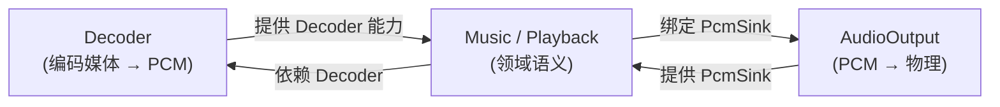
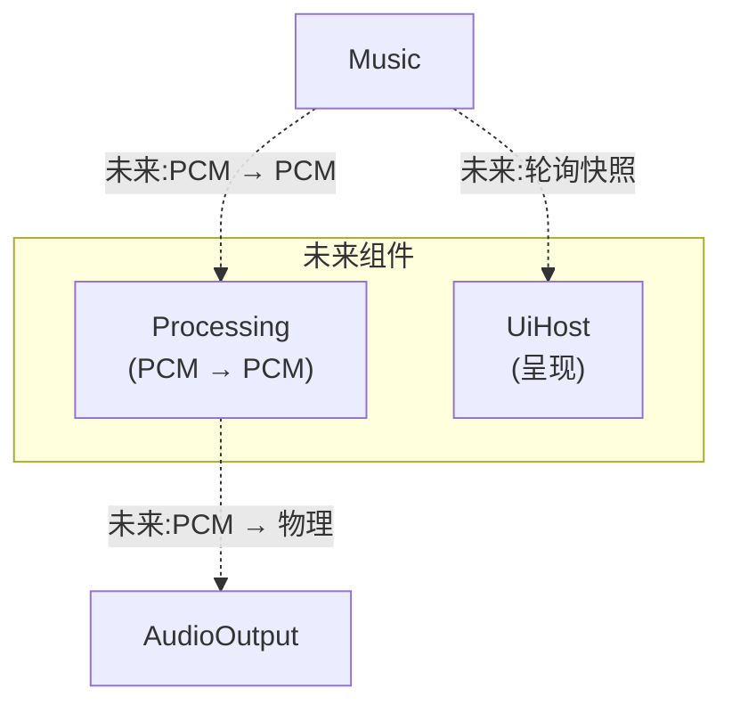

# 插件图

<StatusBadge status="NEXT" />

插件图展示逻辑组件边界及其能力依赖。

<ClaimBadge role="interpretation" />

> 逻辑插件边界 **!=** crate / 动态库边界。

---

## 当前目标形态

---

## 未来组件

---

## 组件依赖矩阵

| 组件 | 依赖 | 提供 |
|------|------|------|
| Music | Decoder、PcmSink | PlaybackControl、PlaybackSnapshot |
| Decoder | 无 | Decoder 能力 |
| AudioOutput | 无 | PcmSink、OutputDeviceDiscovery |
| Processing *(未来)* | PCM 输入 | PCM 输出 |
| UiHost *(未来)* | 快照 | 用户输入 |

---

## 边界论证

每个组件边界必须回答:

- 它拥有什么状态/资源?
- 它需要什么能力?
- 它提供什么能力?
- 哪些操作跨越边界?
- 哪些操作可交换?
- 非可交换顺序在哪里显式表达?

不同的特性名不是组件独立性的证据。

---

<ProvenancePanel
  :authority="['docs/architecture/component-boundary-a0.md', 'docs/architecture/overview.md']"
  :decisions="[{ issue: 53 }, { pr: 66 }]"
  :evidence="['crates/qianqian-core/src/ports.rs']"
/>
