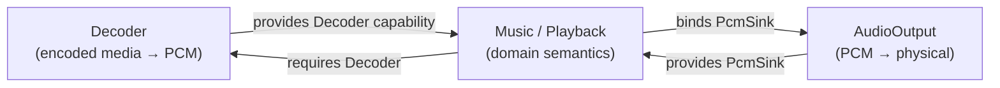
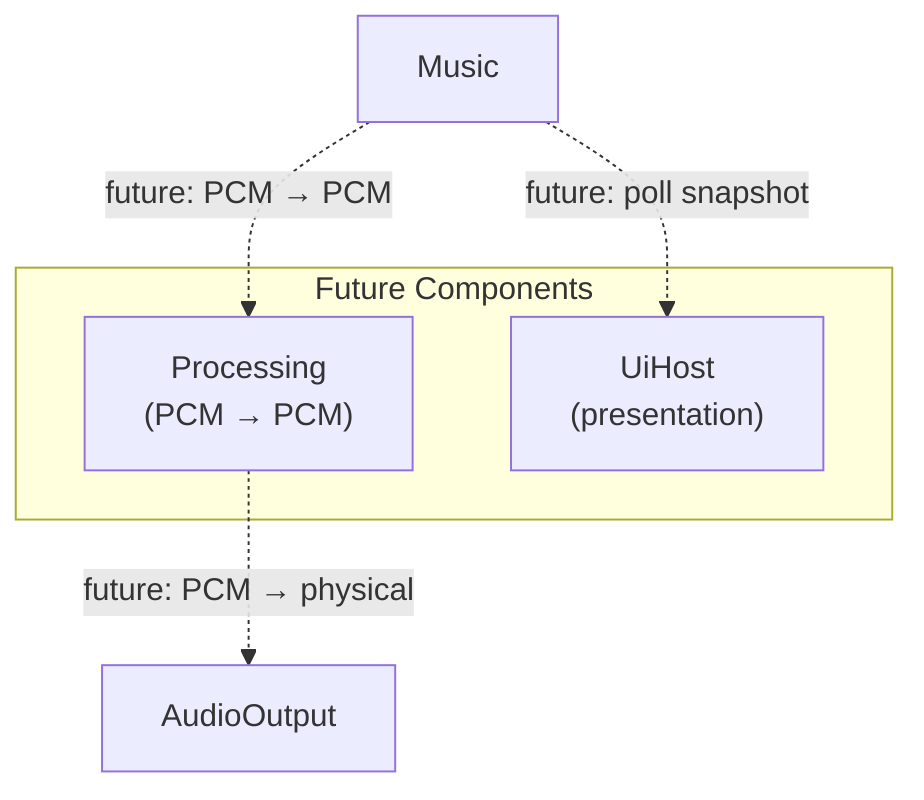

# Plugin Graph

<StatusBadge status="NEXT" />

The plugin graph shows logical component boundaries and their capability dependencies.

<ClaimBadge role="interpretation" />

> Logical plugin boundary **!=** crate/shared-library boundary.

---

## Current Intended Shape

---

## Future Components

---

## Component Dependency Matrix

| Component | Requires | Provides |
|-----------|----------|---------|
| Music | Decoder, PcmSink | PlaybackControl, PlaybackSnapshot |
| Decoder | Nothing | Decoder capability |
| AudioOutput | Nothing | PcmSink, OutputDeviceDiscovery |
| Processing *(future)* | PCM in | PCM out |
| UiHost *(future)* | Snapshot | User input |

---

## Boundary Justification

Every component boundary must answer:

- What state/resources does it own?
- What capabilities does it require?
- What capabilities does it provide?
- What operations cross the boundary?
- Which operations commute?
- Where is non-commutative order explicit?

A different feature name is not evidence of component independence.

---

<ProvenancePanel
  :authority="['docs/architecture/component-boundary-a0.md', 'docs/architecture/overview.md']"
  :decisions="[{ issue: 53 }, { pr: 66 }]"
  :evidence="['crates/qianqian-core/src/ports.rs']"
/>
