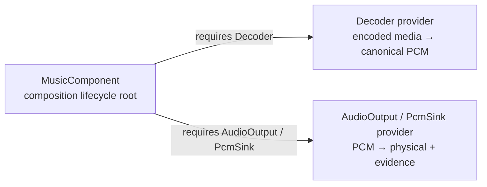
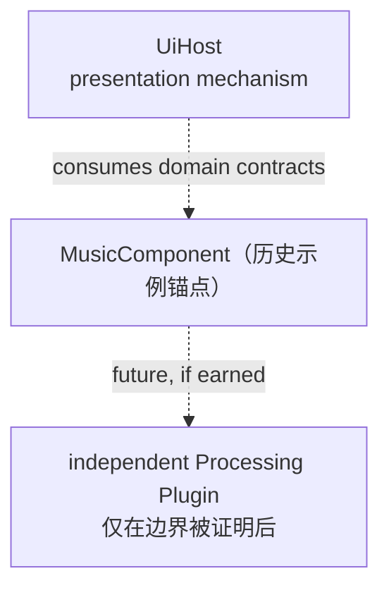

# 插件图

<StatusBadge status="NEXT" />

插件图描述 **Composition topology**：哪些独立 K0 composition identity / lifecycle unit 作为 Plugin/Fiber 参与组合。它不是 PCM Processing Graph。

> **逻辑插件边界 != crate / 动态库边界。**

当前 Plugin taxonomy 由 `ADR-PBK-002` D4/D12 governs，Plugin admission invariant 由 D13 定义；PBK-001 的旧“long-lived capability”措辞只保留为 reset-era decision history。

---

## 组合边界示例（历史实验映射）



> **Historical / experimental evidence:** 上图 `MusicComponent` 与下述 `MusicKernel` / `TransportKernel` / `TrackSession` / `DecodeSession` 结构来自旧 Playback 架构实验（#53 分解），重置后不再是 current authority。旧代码中只保留为 experimental evidence：

```text
MusicKernel      music/product semantic authority
TransportKernel  playback temporal authority
TrackSession(s)
DecodeSession(s)
```

这些内部对象不因为有状态就自动成为独立 Plugin/Fiber。

---

## Processing Graph 不是 Plugin Graph


Gain / EQ / SRC / Limiter 是有顺序的 PCM transform。它们的普通插入、移除和参数更新属于 processing topology，不自动触发 Composition Reconcile。

只有当一个 Processing unit 真正获得独立 K0 composition identity / lifecycle（例如需要独立 activation / invalidation / withdrawal、拥有独立资源/行为边界）时，它才进入 Composition graph。提供 Capability 可以是它的角色之一，但不是 Plugin 身份的必要条件。

---

## 未来组件



> 图中的 `MusicComponent` 锚点只是历史示例；未来组合边界由实验挣得，不由本页决定。

---

## 组件依赖矩阵

| 组件 | 依赖 | 提供 / 角色 |
|---|---|---|
| MusicComponent *（历史示例，非 current authority）* | Decoder、AudioOutput/PcmSink | Playback/domain contracts；内部 lifecycle root |
| Decoder | 无 | Decoder capability |
| AudioOutput | 无 | PcmSink / output evidence / optional device control |
| independent Processing Plugin *(未来，若挣得边界)* | 由未来 contract 决定 | ordered PCM graph service / lifecycle role |
| UiHost *(未来)* | domain/presentation contracts | UI mechanism |

---

## 边界判断

一个候选成为 Plugin 前，要回答（D13 的 review prompt）：

- 是否需要独立 K0 composition identity？
- 是否具有独立 activation / invalidation / withdrawal lifecycle？
- 是否拥有现有 Plugin 无法在不损失 composition correctness / lifecycle ordering 的前提下拥有的资源/行为？（D13 判据）
- 是否 require/provide Capability（可选，不是 admission requirement）？
- 是否存在 composition-level teardown boundary？
- 更细的拆分是否真的换来 composability，而不是只增加命名与配置成本？

**核心不变式（D13）**：若一个现有 Plugin 可以在不损失 composition correctness 或 lifecycle ordering 的前提下完全拥有该候选，该候选必须保持为 owned resource/effect，而不是变成 Plugin。

不同特性名、不同 Rust struct、独立线程，甚至“有生命周期”，都不是独立 Plugin 的充分证据；subordinate endpoint / worker / buffer / payload 默认仍是 Plugin-owned resource/data。

---

<ProvenancePanel
  :authority="['docs/adr/ADR-PBK-001.md', 'docs/adr/ADR-PBK-002.md']"
  :decisions="[{ pr: 66 }, { pr: 78 }, { pr: 79 }, { pr: 139 }]"
  :evidence="['crates/qianqian-audio-api/src/ports.rs', 'crates/qianqian-audio-api/tests/playback_temporal_traces/transport.rs']"
/>
