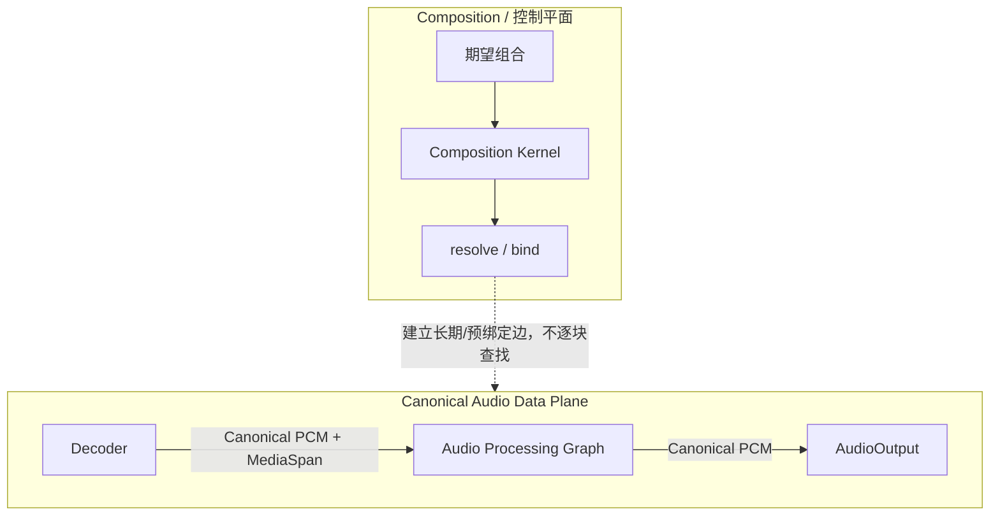
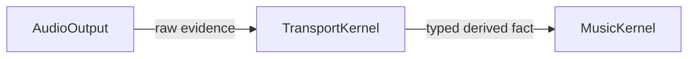

# 控制平面与数据平面

<StatusBadge status="CURRENT" />

> **Capability Plane != Data Plane。**

本页分两层：**已实现**的 generic control/data-plane 防火墙（Base Kernel K0，PR #71），以及 ADR-PBK-001（**PROPOSED / FORMAL CORE PASS**）的 **playback mapping**（TransportKernel / Physical Fence / evidence routing）。后者是拟议模型，不代表真实 PCM playback pipeline 已经实现。

---

## 分离

<ClaimBadge role="authority" />

Context 决定**谁能到达谁**。绑定之后，载荷通过已解析服务或预绑定数据边直接流动。

**已实现层**：generic Composition Kernel 的 control/data-plane 防火墙（K0 oracle 测试，PR #71）保证控制面不逐块接触载荷。



Composition Kernel 不拥有 PCM、MediaSpan、playback cursor、Window、Generation 或 rendered position。图中 Decoder / Processing / AudioOutput 是 capability seam；真实 provider 实现尚未获得授权。

---

## Realtime 热路径绝不允许

<ClaimBadge role="authority" />

每个 callback/block 内不得执行：

- Context lookup
- Capability resolution
- Fiber Reconcile
- 通用 EventBus 派发
- 文件系统 / 网络 I/O
- UI / JS / 托管运行时往返
- 无界分配、锁等待或阻塞

图的变更在 control side 准备，再在 RT-safe boundary 发布。

---

## 播放证据不是通用事件

**当前 Proposed Playback mapping（ADR-PBK-001，PROPOSED）**：AudioOutput 产生的：

```text
submitted evidence
rendered evidence
Physical Fence verdict
device/output evidence
```

属于 playback temporal evidence。拟议的证据路由：



在拟议模型中，TransportKernel 是 raw playback evidence 的语义解释者；MusicKernel 不独立重算 rendered cursor 或 EOF/fence 结果。此映射尚未有可执行实现。

---

## Physical truth

**Proposed playback semantics（ADR-PBK-001，PROPOSED）**：

```text
decoded != queued != submitted != rendered
logical invalidation != physical stop
```

Generation admission 只能阻止新的旧-generation 工作，不能撤回已经提交给设备的旧尾巴。需要 hard cut 时必须得到 Physical Fence 的 definitive verdict。

Fence 进入 claimed 阶段后，后来的 intent 不得假装它没有发生或改写已经开始的 physical transaction。

---

## 数据边生命周期

MusicComponent 通过 Composition Kernel 获得 AudioOutput/PcmSink capability。具体 PCM 边在绑定后成为直接/预绑定 data edge；不能由 composition root 偷偷塞一个反向 Music 指针，也不能让 AudioOutput 通过 Context 在每个 block 反查 Music。

具体 `SinkSession` API/representation 可以随实现演进；长期不变量是：

1. data edge 有明确生命周期与 teardown；
2. provider final release 之前 dependent 完成必要 teardown；
3. RT thread 只触碰预先准备好的 bounded state；
4. raw physical evidence 进入 TransportKernel（拟议映射），而不是全局可写状态袋。

---

## Processing Graph

目标 PCM 路径：

```text
Decoder → Gain / EQ / SRC / ... → AudioOutput
```

这里的 Gain/EQ/SRC 是 Processing Graph node，不等于 Composition plugin。普通参数更新或 node topology change 不自动触发 Fiber Reconcile。

---

<ProvenancePanel
  :authority="['docs/architecture/composition-kernel-0-design.md', 'docs/architecture/overview.md', 'docs/adr/ADR-PBK-001.md']"
  :decisions="[{ pr: 68 }, { pr: 78 }, { pr: 79 }]"
  :implementation="[{ pr: 71 }]"
  :evidence="['crates/qianqian-kernel/tests', 'specs/playback/PlaybackTemporal.tla']"
/>
