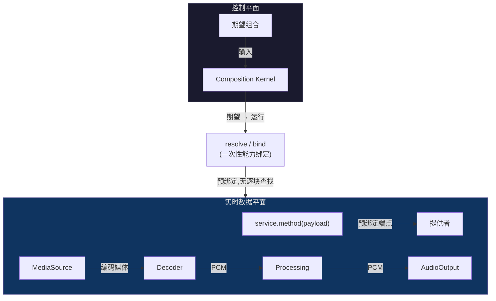

# 控制平面与数据平面

<StatusBadge status="IMPLEMENTED" />

> **能力平面(Capability Plane)!= 数据平面(Data Plane)。**

---

## 分离

<ClaimBadge role="authority" />

Context 决定**谁能到达谁**。绑定之后,载荷**直接**流经已解析的服务/数据边。



---

## 逐块内绝不允许的事

<ClaimBadge role="authority" />

实时音频路径是数据平面孤岛。每个回调/数据块内不得执行:

- Context 查找
- 能力解析
- Fiber 调和
- 任意通用事件派发
- 文件系统/网络 I/O
- UI/JS/托管运行时往返
- 无界分配或阻塞

未来的图变更应在**控制平面**上准备,并在 **RT 安全边界**处发布。

---

## 实时音频路径

目标数据路径:

```text
MediaSource → Decoder → DSP/Processing → AudioOutput
```

所有逐块工作都流经控制平面绑定时建立的**预绑定端点**。热路径中不发生任何通用内核操作。

---

## 为什么这很重要

<ClaimBadge role="interpretation" />

如果 Context/EventBus/Reconcile 出现在音频回调路径中:

1. **延迟** — 通用解析是无界的
2. **确定性** — 块中途的重排/调和会破坏音频
3. **复杂度** — 控制平面与数据平面关注点混杂

这种分离保证音频路径是**确定性的机制孤岛**。

---

## 数据边所有权

<ClaimBadge role="authority" /> 冻结于 component-boundary-a0.md §B.3。

SinkSession 边由依赖方显式的 `PcmSink.bind(PcmSourceEndpoint)` 建立:

- 在控制时刻创建(Music 激活)
- 逐块拉取只通过该会话端点发生
- AudioOutput 只持有交给该会话的端点
- 不存在、也不允许组合根指针接线

这个方向保持图无环。

---

<ProvenancePanel
  :authority="['docs/architecture/composition-kernel-0-design.md', 'docs/architecture/overview.md', 'docs/architecture/component-boundary-a0.md §B.3']"
  :decisions="[{ issue: 67 }, { pr: 68 }]"
  :implementation="[{ pr: 71 }]"
  :evidence="['crates/qianqian-kernel/tests']"
  lastVerified="743eb86"
/>
