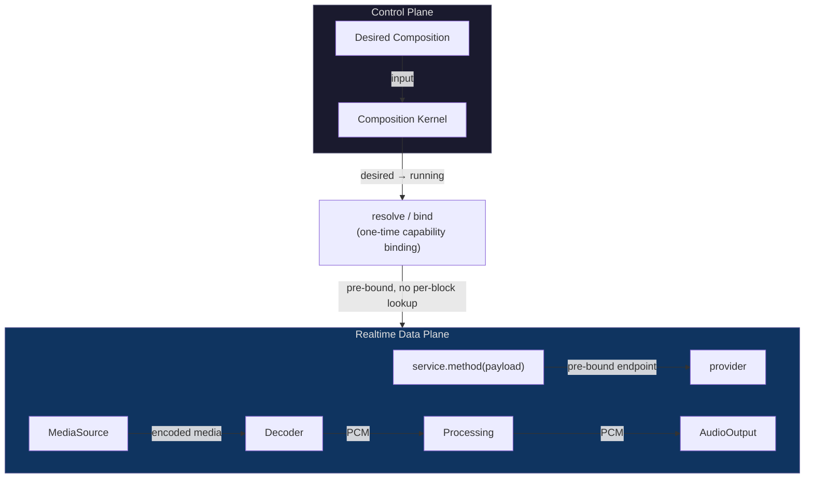

# Control Plane vs Data Plane

<StatusBadge status="IMPLEMENTED" />

> **Capability plane != Data plane.**

---

## Separation

<ClaimBadge role="authority" />

Context determines **who can reach whom**. After binding, payload flows **directly** through the resolved service/data edge.



---

## What Must NOT Happen Per Block

<ClaimBadge role="authority" />

The realtime audio path is a data-plane island. Per callback/block it must not perform:

- Context lookup
- Capability resolution
- Fiber reconciliation
- Arbitrary generic event dispatch
- Filesystem/network I/O
- UI/JS/managed-runtime round trips
- Unbounded allocation/blocking

Future graph changes should be prepared on the **control plane** and published at an **RT-safe boundary**.

---

## Realtime Audio Path

The intended data path:

```text
MediaSource → Decoder → DSP/Processing → AudioOutput
```

All per-block work flows through **pre-bound endpoints** established during control-plane binding. No generic kernel operation occurs in the hot path.

---

## Why This Matters

<ClaimBadge role="interpretation" />

If Context/EventBus/Reconcile appeared in the audio callback path:

1. **Latency** — generic resolution is unbounded
2. **Determinism** — reordering/reconciliation mid-block corrupts audio
3. **Complexity** — control-plane and data-plane concerns mix

The separation guarantees the audio path is a **deterministic mechanism island**.

---

## Data Edge Ownership

<ClaimBadge role="authority" /> Frozen in component-boundary-a0.md §B.3.

The SinkSession edge is established by the dependent's explicit `PcmSink.bind(PcmSourceEndpoint)`:

- Created at control time (Music activation)
- Per-block pull happens only through the session endpoint
- AudioOutput holds only the endpoint handed to that session
- No composition-root pointer wiring exists or is permitted

This direction keeps the graph acyclic.

---

<ProvenancePanel
  :authority="['docs/architecture/composition-kernel-0-design.md', 'docs/architecture/overview.md', 'docs/architecture/component-boundary-a0.md §B.3']"
  :decisions="[{ issue: 67 }, { pr: 68 }]"
  :implementation="[{ pr: 71 }]"
  :evidence="['crates/qianqian-kernel/tests']"
  lastVerified="743eb86"
/>
