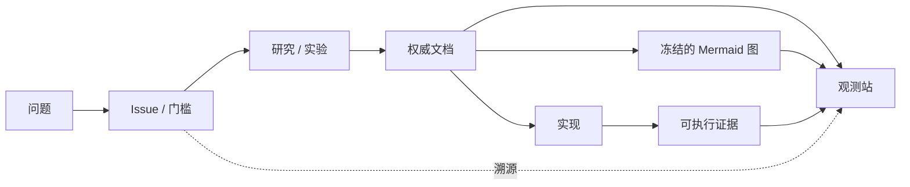

# 路线图

路线图由当前架构权威链驱动。状态来自单一来源:`docs/site/project-state.ts`。

---

## 进度阶梯

| 层 | 状态 | 门槛 |
|----|------|------|
| 播放参考 | <StatusBadge status="HISTORICAL_EVIDENCE" /> | Tag `playback-reference-v1` 已冻结 |
| FFmpeg 闭包研究 | <StatusBadge status="HISTORICAL_EVIDENCE" /> | Issue #48,冻结 profiles 于 playback-reference-v1 |
| 组件边界 A0 | <StatusBadge status="FROZEN" /> | Issue #53 PASS/CLOSED (PR #66) |
| Base Kernel K0 | <StatusBadge status="IMPLEMENTED" /> | Issue #70,PR #71 merged (743eb86) |
| Playback Kernel | <StatusBadge status="NEXT" /> | 设计权威:#53 组件边界 |
| Decoder | <StatusBadge status="PLANNED" /> | 能力定义于 ports.rs,实现待定 |
| Processing | <StatusBadge status="PLANNED" /> | 能力定义于 ports.rs,实现待定 |
| AudioOutput | <StatusBadge status="PLANNED" /> | 能力定义于 ports.rs,实现待定 |
| UI Host | <StatusBadge status="DEFERRED" /> | 平台:PocketJS (Win/Linux),KuiklyUI (Android/iOS) |

---

## 下一个前沿:Playback Kernel

Playback Kernel(MusicKernel)是音乐领域语义权威。它拥有:

- 播放状态机(EMPTY/READY/PLAYING/PAUSED/ENDED/ERROR)
- 媒体时间线真相(position/duration、CONFIRMED/ESTIMATED 落点)
- 活动曲目会话、解码 worker、PCM 环形缓冲
- RT 安全发布边界(commit/flush)
- 队列语义(未来)

**它不是全局组合权威。**

通用 Composition Kernel 处理可达性、所有权与生命周期。MusicKernel 拥有音乐语义。

<ProvenancePanel
  :authority="['docs/architecture/component-boundary-a0.md', 'docs/architecture/overview.md']"
  :decisions="[{ issue: 53 }, { pr: 66 }]"
  :evidence="['research/playback-reference-v1']"
/>

---

## 架构变更协议

变更经过严格的协议流转:

观测站反映已被接受的权威 —— 它从不创造架构真理。

---

<ProvenancePanel
  :authority="['docs/site/project-state.ts', 'AGENTS.md §21']"
  lastVerified="743eb86"
/>
