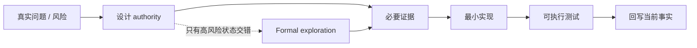

<script setup>
import { projectState } from '../data/project-state.ts'
</script>

# 路线图

路线图只展示当前工程状态；架构语义以仓库 ADR / architecture docs 为准。

---

## 进度阶梯

| 层 | 状态 | 当前事实 |
|---|---|---|
| 播放参考 | <StatusBadge status="HISTORICAL_EVIDENCE" /> | `playback-reference-v1` 是行为证据，不是未来 source-layout 模板 |
| FFmpeg 闭包研究 | <StatusBadge status="HISTORICAL_EVIDENCE" /> | Decoder/Processing 共用单一 closure authority 的历史证据 |
| 组件边界 A0 | <StatusBadge status="FROZEN" /> | #53 历史审计保留；其 playback-specific 结论是历史输入，已被 ACCEPTED 的 ADR-PBK-001 取代（对新 playback 实现） |
| Base / Composition Kernel K0 | <StatusBadge status="IMPLEMENTED" /> | Context / Capability / Fiber / Effect / Reconcile 已实现 |
| Playback Architecture | <StatusBadge status="CURRENT" /> | ADR-PBK-001：ACCEPTED，已登记 ARCH-003 authority；当前前沿是 deterministic executable temporal core（implementation entry） |
| Decoder provider | <StatusBadge status="PLANNED" /> | capability seam 已有；真实 provider 实现未授权于本轮 |
| Audio Processing | <StatusBadge status="PLANNED" /> | ordered PCM graph；普通 DSP node 不自动成为 plugin |
| AudioOutput provider | <StatusBadge status="PLANNED" /> | capability seam 已有；真实设备实现未授权于本轮 |
| UI Host | <StatusBadge status="DEFERRED" /> | UI 不参与 realtime correctness |

---

## 当前前沿：deterministic executable temporal core

**{{ projectState.currentFrontier }}**

ADR-PBK-001 已 **ACCEPTED** 并完成 registry authority 迁移。这一阶段的目标不是实现 FFmpeg/WASAPI 生产机制，而是构建 pure / deterministic / mechanism-independent 的 playback temporal core，作为 implementation entry：

```text
MusicComponent
├── MusicKernel       music/product semantic authority
├── TransportKernel   playback temporal authority
└── TrackSession(s)
    └── DecodeSession(s)
```

本轮由 deterministic trace 测试的实现压力逐步挣得（不预先冻结 struct/module layout）：

- TrackSession / DecodeSession representation；
- Active / Prepared role representation；
- Generation admission executable contract；
- Physical Fence 的 deterministic protocol seam（真实 AudioOutput provider 是后续任务）；
- fence 在途时后续 intent 的 defer/coalesce/latest-wins 等 policy。

---

## 已经不再是开放问题的边界

```text
MusicKernel != playback timeline authority
TransportKernel = playback temporal authority
TrackSession may own multiple DecodeSessions
Active + Prepared may coexist
stale is admission-based, not global-current equality
logical invalidation != physical stop
Composition Graph != Audio Processing Graph
```

在 ADR-PBK-001 已接受模型内部，这些不是实现者可随意重新选择的风格偏好；若施工发现需要改变其中任何一条已冻结边界，必须走 ADR + specs + tests 的同步 corrective 事务。

---

## 下一步问题

<template v-for="(q, i) in projectState.nextQuestions" :key="i">
1. {{ q }}
</template>

---

## 验证升级原则



> **TLA+ 用来找撞车，不用来证明整个架构。**

---

<ProvenancePanel
  :authority="['docs/adr/ADR-PBK-001.md', 'docs/architecture/overview.md', 'docs/site/project-state.ts']"
  :decisions="[{ pr: 78 }, { pr: 79 }]"
  :evidence="['specs/playback/PlaybackTemporal.tla', 'crates/qianqian-core/src/transport.rs']"
/>
