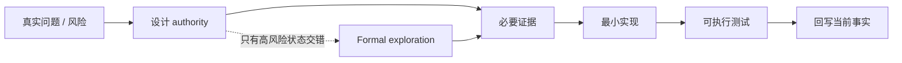

<script setup>
import { projectState } from '../data/project-state.ts'
</script>

# 路线图

路线图展示当前工程状态，并保留明确标注的历史 checkpoint；架构语义以仓库 ADR / architecture docs 为准。

当前执行阅读入口为 [playback execution model](https://github.com/jnhu76/qianqian/blob/main/docs/architecture/playback-execution-model.md)：Stage 4 #207/#214 已合并，Stage 5 #208 为 explicitness pass，C1 #205/C2 #213 已合并；D1–D6 已由 #209 ACCEPT（PASS_ARCHITECTURE_ACCEPTED）、#210 FROZEN。§1 路由 accepted PBK/K0/DSP/temporal owning authorities，§12 保留 20/20 traceability；Stage 8 验证属于 #211（绑定 #212 契约）。

---

## 进度阶梯

| 层 | 状态 | 当前事实 |
|---|---|---|
| 播放参考 | <StatusBadge status="HISTORICAL_EVIDENCE" /> | `playback-reference-v1` 是行为证据，不是未来 source-layout 模板 |
| FFmpeg 闭包研究 | <StatusBadge status="HISTORICAL_EVIDENCE" /> | Decoder/Processing 共用单一 closure authority 的历史证据 |
| 组件边界 A0 | <StatusBadge status="HISTORICAL_EVIDENCE" /> | #53 历史审计保留；其 playback-specific 结论是历史证据，不是 current authority |
| Base / Composition Kernel K0 | <StatusBadge status="IMPLEMENTED" /> | Context / Capability / Fiber / Effect / Reconcile 已实现 |
| Playback Foundations | <StatusBadge status="CURRENT" /> | PBK-001/002/003 ACCEPTED；当前已挣得的最小播放语义已有实现，旧模型仍是历史证据 |
| Decode Plugin / Decoder | <StatusBadge status="IMPLEMENTED" /> | SongCore-backed provider；ownership/lifetime 见 PBK-002 D6/D14 |
| Episode-owned Audio Processing | <StatusBadge status="IMPLEMENTED" /> | Gain + 10-band EQ / live update；PBK-002 D14.11、DSP §7.3；不是独立 Plugin |
| Output Plugin / AudioOutput | <StatusBadge status="IMPLEMENTED" /> | backend-neutral contract，当前 owned WASAPI mechanism；PBK-003；不构成本次设备验证 |
| UI Host | <StatusBadge status="DEFERRED" /> | UI 不参与 realtime correctness |

---

## 历史前沿：Playback Foundations reset checkpoint

以下 metadata 与 Phase-B/C/D/E/F ladder 保留 PR #101–#103 checkpoint 的读法，不描述当前执行 campaign。当前状态以本页开头和 execution model 为入口。

**{{ projectState.currentFrontier }}**

旧版 ADR-PBK-001（MusicComponent / MusicKernel / TransportKernel 模型）及其 deterministic executable temporal core 已随 2026-09 架构重置降级为 experimental evidence。重置后的 Playback Foundations 已 ACCEPTED；realtime publication/lifetime 在 bounded model/assumptions 内检查（`specs/realtime-publication/`），不是整个架构的证明；其语义协议 **P1–P5 已 normative 冻结于 ADR §6**；Realtime Runtime 责任有机制证据（`docs/architecture/realtime-view-publication.md`，Issue #94 closed）。当时的 ladder：

- composition reality 之上的 minimal PCM contract（Phase B）——**已交付**（PR #93）；
- direct Source → processing → Sink 数据流（Phase C）——**已交付**（PR #96）；
- publication/reclamation **机制验证**：候选机制在真实 Audio Runtime 下满足已冻结的 P1–P5（Phase D 验证机制，不再裁决 P1–P5 是否正确）——首轮机制证据已交付（PR #97），机制最终裁决仍 OPEN；
- 真实 decoder / output 机制（Phase E）；
- 只有到那时才重新挣得 seek / stop / track / session 等播放语义（Phase F）。

（one normative ladder 见 `docs/adr/ADR-PBK-001.md` §12。）

---

## 实验证据中的历史边界（非 current authority）

```text
MusicKernel / TransportKernel authority split
TrackSession may own multiple DecodeSessions
Active + Prepared may coexist
stale is admission-based, not global-current equality
logical invalidation != physical stop
Composition Graph != Audio Processing Graph
```

这些是旧实验的可复用 failure witnesses / 测试技术；重置后它们**不是**实现者必须遵守的已冻结边界，也不得仅因旧代码存在而自动成为新设计前提。是否重新挣得其中某条边界，由 `docs/adr/ADR-PBK-001.md`（ACCEPTED）之下的真实实验决定。

---

## 该历史 checkpoint 的下一步问题

<template v-for="(q, i) in projectState.nextQuestions" :key="i">
1. {{ q }}
</template>

---

## 验证升级原则



> **TLA+ 用来找撞车，不用来证明整个架构。**

---

PR #78 / #79 属于旧 ADR 修订历史（experimental evidence），不再列为当前决策记录。

<ProvenancePanel
  :authority="['docs/adr/ADR-PBK-001.md', 'docs/adr/ADR-PBK-002.md', 'docs/adr/ADR-PBK-003.md', 'docs/architecture/playback-execution-model.md']"
  :decisions="[]"
  :evidence="['specs/composition-kernel-0/CompositionKernel0.tla', 'specs/realtime-publication/RealtimePublication.tla']"
/>
