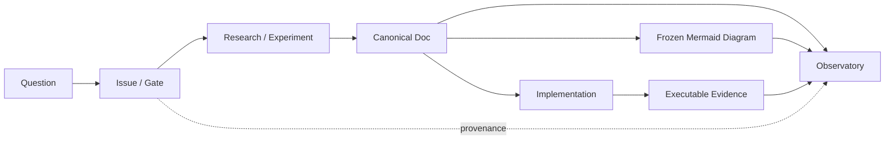

# Roadmap

The roadmap is driven by the current architecture authority chain. Status comes from a single source: `docs/site/project-state.ts`.

---

## Progress Ladder

| Layer | Status | Gate |
|-------|--------|------|
| Playback Reference | <StatusBadge status="HISTORICAL_EVIDENCE" /> | Tag `playback-reference-v1` frozen |
| FFmpeg Closure Research | <StatusBadge status="HISTORICAL_EVIDENCE" /> | Issue #48, frozen profiles on playback-reference-v1 |
| Component Boundary A0 | <StatusBadge status="FROZEN" /> | Issue #53 PASS/CLOSED (PR #66) |
| Base Kernel K0 | <StatusBadge status="IMPLEMENTED" /> | Issue #70, PR #71 merged (743eb86) |
| Playback Kernel | <StatusBadge status="NEXT" /> | Design authority: #53 component boundary |
| Decoder | <StatusBadge status="PLANNED" /> | Capability defined in ports.rs, implementation TBD |
| Processing | <StatusBadge status="PLANNED" /> | Capability defined in ports.rs, implementation TBD |
| AudioOutput | <StatusBadge status="PLANNED" /> | Capability defined in ports.rs, implementation TBD |
| UI Host | <StatusBadge status="DEFERRED" /> | Platform: PocketJS (Win/Linux), KuiklyUI (Android/iOS) |

---

## Next Frontier: Playback Kernel

The Playback Kernel (MusicKernel) is the music-domain semantic authority. It owns:

- Playback state machine (EMPTY/READY/PLAYING/PAUSED/ENDED/ERROR)
- Media-timeline truth (position/duration, CONFIRMED/ESTIMATED landing)
- Active track session, decode worker, PCM ring
- RT-safe publication boundary (commit/flush)
- Queue semantics (future)

**It is not the global composition authority.**

The generic Composition Kernel handles reachability, ownership, and lifetime. MusicKernel owns music semantics.

<ProvenancePanel
  :authority="['docs/architecture/component-boundary-a0.md', 'docs/architecture/overview.md']"
  :decisions="[{ issue: 53 }, { pr: 66 }]"
  :evidence="['research/playback-reference-v1']"
/>

---

## Architecture Change Protocol

Changes flow through a strict protocol:

The Observatory reflects accepted authority — it never creates architecture truth.

---

<ProvenancePanel
  :authority="['docs/site/project-state.ts', 'AGENTS.md §21']"
  lastVerified="743eb86"
/>
