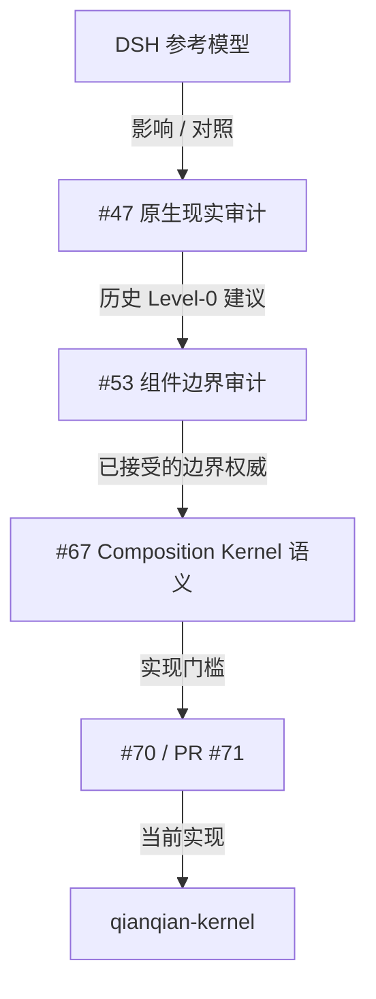

# DSH → Composition Kernel 演进

<StatusBadge status="HISTORICAL_EVIDENCE" />

## 一场历史对照如何启发了 Composition Kernel —— 又如何被它取代

> 本页是**历史证据**,不是当前架构权威。当前架构权威在 `docs/architecture/`。DSH 本身只是这条演进线中的参照/影响,绝不是 Qianqian 当前设计的规范性母体。

---

## 1. DSH 向我们展示了什么

### DSH 指涉对象的证据状态

<ClaimBadge role="evidence" />

**证据缺口。** "DSH" 的确切外部来源已无法从本仓库恢复:

- `git log --all` 与每个 tag(`pre-rust-v2`、`playback-reference-v1`、`songcore-v0.1.0`)都不含 `coreDsh` / `CoreDsh` / `startCoreDsh` 符号;
- 检索早于本 WEB-EVIDENCE-1 任务的 GitHub issue 历史(issue #74 本身现已带有大量 DSH 背景):issue #47 将 "DSH" 用作架构对照,issue #46 下的一条 2026-09-06 评审评论也把 DSH 用作 Base Kernel 设计词汇 —— 两者都没有定义或链接这个缩写(issue #73 提到 DSH 只是为了把它排除在该任务范围之外);
- GitHub 代码搜索一无所获。

因此我们**不**展开这个缩写、不引用论文、不指认项目身份。可证明的是 #47 如何使用该模型。

### #47 用 DSH 做了什么

Issue #47(PLAYER-PLUGIN-ARCH-A0,CLOSED —— **HISTORICAL / SUPERSEDED**)对真实的原生播放工作流(PlayerEngine、WASAPI renderer、SongCore 解码、桌面桥)做了现实审计。在其建议部分,它与一个 "DSH 级" 模型作了对照 —— 一个单桌面宿主/进程运行时,UI/插件/工作台生态可以围绕它构建,并带有一套分级组合机制阶梯:

| 级别 | 机制 | #47 判定 |
|------|------|----------|
| 0 | 显式 factory / composition root | NEEDED |
| 1 | 静态能力注册表 | USEFUL_LATER |
| 2 | 动态运行时组合 | NOT_JUSTIFIED |
| 3 | 动态二进制生态 / DLL / 热加载 | NOT_JUSTIFIED |

当时的历史结论:

> **MVP = 仅 Level 0。不要因为 DSH 有就照抄 DSH。**

那句话是过去一次审计中的推理证据 —— 它**不是**当前建议,也**不是**当前架构权威。

---

## 2. Qianqian 最初否决了什么

旧的播放实现只论证了显式 composition root:

```text
真实组件很少(engine、renderer、藏在一条缝后的 SongCore)
没有被论证的 mount/unmount 需求
没有理由要动态 DLL 生态
实时路径不得引入注册表/动态查找
```

Level 1 保留为"以后有用"(一旦组件数 ≥ 3 且出现第二个组合轴,类型化注册表就变得有意义);Level 2–3 被直接否决,#46 的 MVP 禁令加上项目的依赖边界规则把第三方运行时插件生态排除在外。

---

## 3. Qianqian 后来为何超越 Level 0

项目**不是**因为 "DSH 更好" 而改变方向。证据链来自后来变得具体的需求:

```text
显式能力可达性
提供者撤回
依赖方先于提供者释放完成 teardown
拥有的 Effect
拥有的关系/数据边绑定
期望状态调和
FAILED / 静息语义
组合合流性
领域连续性分离
```

这些具体需求使"仅一个显式 composition root"不再充分,并产出了实际的权威链(已于 2026-09-07 对照 GitHub/main 核验):



| 步骤 | 状态(2026-09-07 核验) |
|------|------------------------|
| #47 PLAYER-PLUGIN-ARCH-A0 | CLOSED —— 历史证据;Level 0 建议 |
| #53 COMPONENT-BOUNDARY-A0 | CLOSED/PASS —— 已接受的审计,经 PR #66 合并(`component-boundary-a0.md`) |
| #67 COMPOSITION-KERNEL-0 design | CLOSED —— 语义设计经 PR #68 合并(+ PR #69 Corrective-4) |
| #70 COMPOSITION-KERNEL-0 implementation | OPEN issue;实现 PR #71 **MERGED**(`743eb862`) |
| `crates/qianqian-kernel` | main 上的当前实现(Context / Capability / Fiber / Effect / Reconcile) |

这**不**意味着 Qianqian 采纳了整个 DSH 运行时模型 —— 见下文当前边界。

---

## 4. 当前边界是什么

<ClaimBadge role="authority" />

| 想法 | 当前状态 | 证据 |
|------|----------|------|
| 显式组合权威 | 已采纳 / 演化为 Kernel | `crates/qianqian-kernel/src/kernel.rs`(`Kernel`、`set_desired`、`settle`) |
| 能力/依赖可达性 | 已在 K0 实现 | `crates/qianqian-kernel/src/context.rs`(`ActivationCtx::resolve`)+ `capability.rs` |
| Fiber 生命周期 | 已在 K0 实现 | `crates/qianqian-kernel/src/fiber.rs`(`FiberState`) |
| 拥有的 Effect 生命周期 | 已在 K0 实现 | `crates/qianqian-kernel/src/kernel.rs`(`EffectHandle`、LIFO 展开) |
| 期望 → 运行 Reconcile | 已在 K0 实现 | `crates/qianqian-kernel/src/desired.rs` + `Kernel::step/settle/is_quiet` |
| 变更历史后的合流性 | 已实现 + 已测试 | `crates/qianqian-kernel/tests/confluence_oracles.rs`(70 内核 / 75 workspace 测试,`743eb862`) |
| 经 Context 传领域载荷 | 已否决 | AGENTS.md "Context is not a data bus";`CONTEXT.md` "Capability plane != Data plane" |
| 逐块 PCM Context/注册表查找 | 已否决 | AGENTS.md "Realtime boundary"(仅预绑定数据边) |
| 注册顺序当拓扑 | 已否决 | AGENTS.md "Interaction algebra"(显式排序;非可交换关系需要显式结构) |
| 通用动态 DLL/插件生态 | 尚未实现 / 当前缺乏充分依据 | main 上不存在 loader;AGENTS.md "Everything is a Plugin" ≠ 动态库 |
| 作为架构需求的 HMR | 尚未实现 | — |
| 插件市场 / semver 求解器 | 尚未实现 | — |

一句话的边界:

> **Composition Kernel 已实现 ≠ 动态二进制插件生态已实现 ≠ 一切都流经 Context。**

---

<ProvenancePanel
  :authority="['docs/architecture/component-boundary-a0.md', 'docs/architecture/composition-kernel-0-design.md', 'docs/architecture/composition-kernel.md', 'docs/architecture/overview.md']"
  :decisions="[{ issue: 47 }, { issue: 53 }, { issue: 67 }, { pr: 68 }]"
  :implementation="[{ issue: 70 }, { pr: 71 }]"
  :evidence="['crates/qianqian-kernel/tests']"
  last-verified="GitHub issue/PR states + current main scan, 2026-09-07"
/>
