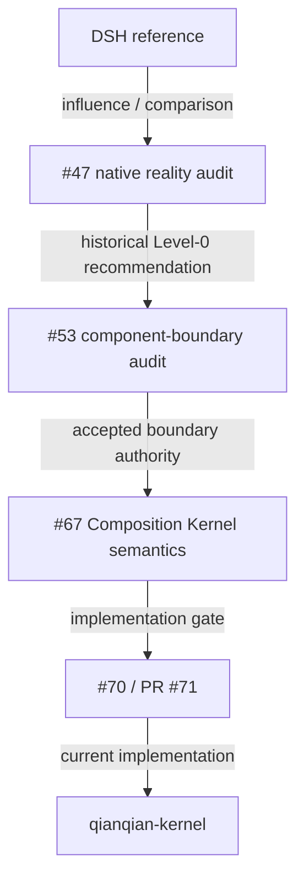

# DSH → Composition Kernel Lineage

<StatusBadge status="HISTORICAL_EVIDENCE" />

## How a historical comparison informed — and was then superseded by — the Composition Kernel

> This page is **historical evidence**, not current architecture authority. Current architecture authority lives in `docs/architecture/`. DSH itself is a reference/influence in this lineage, never a normative parent of Qianqian's current design.

---

## 1. What DSH showed us

### Evidence status of the DSH referent

<ClaimBadge role="evidence" />

**Evidence gap.** The exact external source of "DSH" is not recoverable from this repository:

- `git log --all` and every tag (`pre-rust-v2`, `playback-reference-v1`, `songcore-v0.1.0`) contain no `coreDsh` / `CoreDsh` / `startCoreDsh` symbols;
- searching the GitHub issue history that predates this WEB-EVIDENCE-1 task (issue #74 itself now carries extensive DSH context): issue #47 uses "DSH" as an architectural comparison, and one 2026-09-06 review comment on issue #46 also uses DSH as Base-Kernel design vocabulary — neither defines or links the acronym (issue #73 mentions DSH only to exclude it from that task's scope);
- GitHub code search finds nothing.

We therefore do **not** expand the acronym, cite a paper, or attribute a project identity. What is provable is how #47 used the model.

### What #47 used DSH for

Issue #47 (PLAYER-PLUGIN-ARCH-A0, CLOSED — **HISTORICAL / SUPERSEDED**) performed a reality audit of the real native playback workflow (PlayerEngine, WASAPI renderer, SongCore decode, desktop bridge). As part of its recommendation section it compared against a "DSH-level" model — a single desktop host/process runtime around which a UI/plugin/workbench ecosystem could be built, with a graded ladder of composition mechanisms:

| Level | Mechanism | #47 verdict |
|-------|-----------|-------------|
| 0 | explicit factory / composition root | NEEDED |
| 1 | static capability registry | USEFUL_LATER |
| 2 | dynamic runtime composition | NOT_JUSTIFIED |
| 3 | dynamic binary ecosystem / DLL / hotload | NOT_JUSTIFIED |

The historical conclusion at that time:

> **MVP = Level 0 only. Do not copy DSH merely because DSH has it.**

That sentence is reasoning evidence from a past audit — it is **not** a current recommendation and **not** current architecture authority.

---

## 2. What Qianqian initially rejected

The old playback implementation justified only an explicit composition root:

```text
few real components (engine, renderer, SongCore behind one seam)
no justified mount/unmount requirement
no reason for a dynamic DLL ecosystem
the realtime path must not gain registry/dynamic lookup
```

Level 1 was kept as "useful later" (a typed registry becomes interesting once component count ≥ 3 and a second composition axis appears); Levels 2–3 were rejected outright, and #46's MVP ban plus the project's dependency-boundary rules excluded third-party runtime plugin ecosystems.

---

## 3. Why Qianqian later went beyond Level 0

The project did **not** change direction because "DSH was better". The evidence chain comes from requirements that became concrete later:

```text
explicit capability reachability
provider withdrawal
dependent teardown-before-provider-release
owned effects
owned relation/data-edge bindings
desired-state reconciliation
FAILED / quiescence semantics
composition confluence
domain continuity separation
```

These concrete requirements made "only an explicit composition root" insufficient, and produced the actual authority chain (verified against GitHub/main on 2026-09-07):



| Step | State (verified 2026-09-07) |
|------|------------------------------|
| #47 PLAYER-PLUGIN-ARCH-A0 | CLOSED — historical evidence; Level 0 recommendation |
| #53 COMPONENT-BOUNDARY-A0 | CLOSED/PASS — accepted audit merged via PR #66 (`component-boundary-a0.md`) |
| #67 COMPOSITION-KERNEL-0 design | CLOSED — semantic design merged via PR #68 (+ PR #69 Corrective-4) |
| #70 COMPOSITION-KERNEL-0 implementation | OPEN issue; implementation PR #71 **MERGED** (`743eb862`) |
| `crates/qianqian-kernel` | current implementation on main (Context / Capability / Fiber / Effect / Reconcile) |

This does **not** mean Qianqian adopted the entire DSH runtime model — see the current boundary below.

---

## 4. What is the current boundary

<ClaimBadge role="authority" />

| Idea | Current standing | Evidence |
|------|------------------|----------|
| explicit composition authority | adopted / evolved into the Kernel | `crates/qianqian-kernel/src/kernel.rs` (`Kernel`, `set_desired`, `settle`) |
| capability/dependency reachability | implemented in K0 | `crates/qianqian-kernel/src/context.rs` (`ActivationCtx::resolve`) + `capability.rs` |
| Fiber lifecycle | implemented in K0 | `crates/qianqian-kernel/src/fiber.rs` (`FiberState`) |
| owned Effect lifecycle | implemented in K0 | `crates/qianqian-kernel/src/kernel.rs` (`EffectHandle`, LIFO unwind) |
| desired → running Reconcile | implemented in K0 | `crates/qianqian-kernel/src/desired.rs` + `Kernel::step/settle/is_quiet` |
| confluence after mutation history | implemented + tested | `crates/qianqian-kernel/tests/confluence_oracles.rs` (70 kernel / 75 workspace tests at `743eb862`) |
| domain payload through Context | rejected | AGENTS.md "Context is not a data bus"; `CONTEXT.md` "Capability plane != Data plane" |
| per-block PCM Context/registry lookup | rejected | AGENTS.md "Realtime boundary" (pre-bound data edges only) |
| registration order as topology | rejected | AGENTS.md "Interaction algebra" (explicit ordering; non-commutative relations need explicit structure) |
| generic dynamic DLL/plugin ecosystem | not implemented / not currently justified | no loader exists on main; AGENTS.md "Everything is a Plugin" ≠ dynamic libraries |
| HMR as architecture requirement | not implemented | — |
| plugin marketplace / semver solver | not implemented | — |

The boundary in one sentence:

> **Composition Kernel implemented ≠ dynamic binary plugin ecosystem implemented ≠ everything flows through Context.**

---

<ProvenancePanel
  :authority="['docs/architecture/component-boundary-a0.md', 'docs/architecture/composition-kernel-0-design.md', 'docs/architecture/composition-kernel.md', 'docs/architecture/overview.md']"
  :decisions="[{ issue: 47 }, { issue: 53 }, { issue: 67 }, { pr: 68 }]"
  :implementation="[{ issue: 70 }, { pr: 71 }]"
  :evidence="['crates/qianqian-kernel/tests']"
  last-verified="GitHub issue/PR states + current main scan, 2026-09-07"
/>
